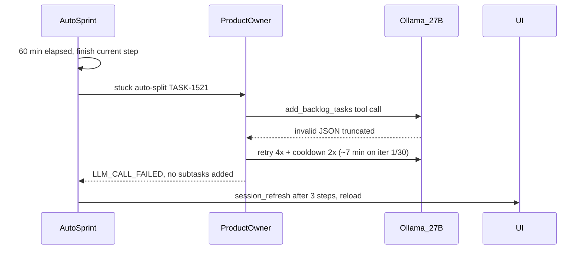

# Fix PO split `add_backlog_tasks` JSON failures at session refresh

## What your logs show (02:47–02:50)

Two things happened back-to-back — both normal triggers, bad outcome:



| Log line | Meaning |
|----------|---------|
| **Auto sprint session refresh after 60 minute(s)** | Expected — [`autoSprintSessionRefreshMinutes: 60`](backend/services/workflow_settings.py) fired; sprint ends cleanly and UI reloads/resumes |
| **Split TASK-1521: no subtasks added** | [`run_po_split_task()`](backend/services/sprint_service.py) ran (stuck recovery on a visit-cap card), but split did not supersede the parent |
| **`invalid tool call arguments for "add_backlog_tasks": unexpected end of JSON input`** | llama-server truncated the **large** `add_backlog_tasks` tool-args JSON mid-generation (same class of failure as Dev `list_dir` at 4096 ctx) |
| **Still waiting for Ollama — 408s, iter 1/30** | One LLM iteration stuck in provider retry loop (4 attempts + 2 cooldown attempts) before giving up — not 408 separate iterations |

**Not a broken session refresh** — refresh finished the step; the step itself was a **slow failed PO split**.

## Why `add_backlog_tasks` fails more than `list_dir`

[`tool_json_recovery.py`](backend/services/tool_json_recovery.py) only recovers **explore tools** with safe defaults:

```15:19:backend/services/tool_json_recovery.py
_DEFAULT_TOOL_ARGS = {
    "list_dir": {},
    "glob_file_search": {"pattern": "**/*", "limit": 100},
    ...
}
```

`add_backlog_tasks` is **not** in that map — its schema in [`registry.py`](backend/agents/registry.py) is huge (nested `tasks[]` with AC, workType, etc.). At 27B + long split prompt, Ollama often hits `doneReason=length` and returns **empty/truncated tool JSON**. Recovery returns `None` → scrum agent retries 4× + cooldown 2× → ~7 minutes wasted on iteration 1.

There **is** a JSON fallback path ([`apply_backlog_from_po_response()`](backend/services/sprint_service.py) ~964), but it only runs when `execute_step` returns **text**, not `LLM_CALL_FAILED: …`.

## Context note (your newer diagnostics)

Sep 18 traces show improvement: **`num_ctx 16384`** (not VRAM-clamped to 4096) on TASK-5004/TASK-54835. Dev on TASK-54835 ran **~53 min** with real writes (`apply_patch`, `write_file`) — sprint is moving, but 27B steps are very slow.

TASK-5004 still shows **`forcedPatch: false`** despite `forcePatchNextDevStep: true` — separate issue from this PO split; verify backend was restarted with the duplicate_tool Forced Patch wiring from the prior fix.

---

## Recommended fixes (priority order)

### P0 — Deterministic split fallback when PO LLM fails

In [`run_po_split_task()`](backend/services/sprint_service.py) (~3512–3556), after `execute_step` returns:

- If output starts with `LLM_CALL_FAILED` **or** transcript shows `invalid_tool_json` for `add_backlog_tasks` **and** `added == 0`:
  - Call existing **`apply_backlog_from_po_response()`** with a **deterministic 2-slice template** (reuse the stub already used in the `SIMULATION_FALLBACK` branch ~3525–3537), keyed off parent title/description/AC
  - Log `po_split_deterministic_fallback` diagnostic event
  - Avoid leaving TASK-1521 stuck after a 7-minute failed split

This matches product intent: stuck visit-cap cards should split, not burn another hour.

### P0 — JSON-only PO split mode (avoid huge tool schema)

Add a split-specific tool mode in [`po_execute_step_tools()`](backend/agents/scrum_agent.py) or a parameter to `execute_step`:

- For **`run_po_split_task` only**: pass `json_only_split=True` → **no Ollama tools** (like `PLANNING_BACKLOG` json-only path at line 316–317)
- Prompt already instructs: *"If you cannot use tools, reply with ONLY a JSON array"*
- On success, `apply_backlog_from_po_response()` handles the array
- **Much smaller generation** → far fewer truncated tool JSON errors

Alternative (narrower): expose **only** `add_backlog_tasks` in tools for split, not the full PO toolbelt — still large schema, so JSON-only is safer.

### P1 — Fail fast on unrecoverable `invalid_tool_json`

In [`scrum_agent._run_attempts()`](backend/agents/scrum_agent.py) (~1586–1607):

- When `is_invalid_tool_json_error` and `default_arguments_for_tool_recovery()` returns **None** (PO board tools: `add_backlog_tasks`, `update_board`, `add_subtasks`):
  - **Do not** run full 4+2 retry storm on the same iteration
  - Break early with `invalid_tool_json` so upper layers can fall back to JSON-only retry or deterministic split

Optionally: one immediate **num_ctx bump + single retry** for PO when truncated (similar to context overflow path).

### P1 — Cap PO split step cost

For `run_po_split_task` / stuck auto-split:

- Use lower `max_iterations` (e.g. 3–5, not 30)
- Or dedicated `maxAgentStepDurationSec` cap (e.g. 120s) for split-only calls
- Prevents a single split from blocking session refresh for 7+ minutes

### P2 — Session refresh UX (settings, no code required)

Document / surface in UI:

- **Workflow → Autonomy**: `autoSprintSessionRefreshEnabled` / `autoSprintSessionRefreshMinutes` (default 60)
- Disable or raise to 120+ if reload mid-split is disruptive
- Refresh is **working as designed**; the pain was the PO step inside it

### P2 — Operational mitigations (immediate, no code)

Until fixes ship:

- Use a **smaller PO model** (8B–14B) for split/clarification; keep 27B for Dev if desired
- Manually split TASK-1521 via Task Detail → PO chat with JSON array, or move to Needs PO
- **`ollamaNumCtxAuto: off`** with moderate manual ctx if PO still truncates tool JSON

---

## Tests to add

- [`tests/test_tool_call_normalizer.py`](tests/test_tool_call_normalizer.py) or new `test_po_split_fallback.py`:
  - `run_po_split_task` + mocked `execute_step` returning `LLM_CALL_FAILED: invalid_tool_json…` → deterministic split adds ≥2 backlog cards, parent → Done
  - JSON-only split mode → no tools passed to provider, `apply_backlog_from_po_response` called on array text
- Extend [`tests/test_smoke.py`](tests/test_smoke.py) `test_add_backlog_tasks_split_moves_source_to_done` with failure-path coverage

---

## Validation

1. Trigger stuck auto-split on a visit-cap In Progress card (or manual Split on TASK-1521)
2. Confirm split completes in **<60s** even when first Ollama call returns invalid tool JSON
3. System log should show deterministic or JSON fallback — not 400s of "Still waiting for Ollama"
4. Session refresh at 60 min should no longer coincide with multi-minute PO retry storms

## Files to change

- [`backend/services/sprint_service.py`](backend/services/sprint_service.py) — `run_po_split_task` fallbacks, optional split template helper
- [`backend/agents/scrum_agent.py`](backend/agents/scrum_agent.py) — JSON-only split mode; fail-fast for unrecoverable tool JSON
- [`backend/services/tool_json_recovery.py`](backend/services/tool_json_recovery.py) — optional: classify PO tools as non-recoverable (documentation only)
- Tests under [`tests/`](tests/)
