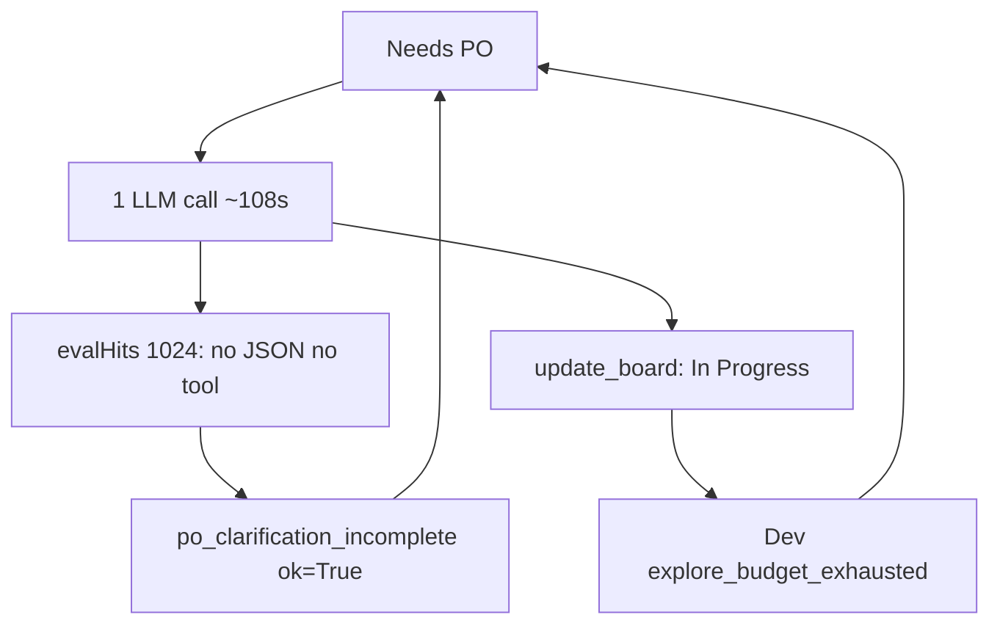

# Did the PO speed changes help?

**Yes for the original bug. Only partly for end-to-end task time.**

Before (Club Card traces): Product Owner only, **2–7 LLM calls** per step, **3–12 minutes**, `update_board` often skipped, **lane stayed Needs PO**, one card ran **20 PO steps**. Developer never started.

After (51 new traces, ~16:32–17:57, same 26B Gemma):

| Signal | Before | After |
| --- | --- | --- |
| PO LLM calls / step | 2–7 | **almost always 1** (mean 1.03) |
| PO step duration | 3–12 min | **~108s median** (98–155s) |
| Exit labels | fake `fix_verify_done` | `po_clarified` / `po_clarification_incomplete` |
| Left Needs PO | almost never | **6 steps** actually moved (In Progress or Done) |
| Developer ran | never | **yes** — then died on explore budget |

When the model emits `update_board` in that single turn, the new apply/move path works: e.g. [step-TASK-9B09…163252](file) 1 call, 133s, `update_board → In Progress`. That is the intended win.

## What still burns time

**1. `num_predict=1024` truncates Gemma before JSON or a tool call**

On `Store & Aisle Management UI (1/2) (2/2)` there are **21 PO steps**, all `po_clarification_incomplete`, almost all with:

- `evalTokensTotal` **exactly 1024**
- `textChars: 0`, `toolsUsed: []`, empty snippet
- still **~105s** of prefill+decode

The cap we added to stop 2000-token JSON novels now cuts off the first tool call. The step then **exits `ok=True`**, so auto-sprint immediately starts another identical ~105s PO turn. That is **~37 minutes** of empty generations — worse than a 2-call PO step that actually moves.

Circuit breaker does not stop this: it is wired for stuck **In Progress / Dev**, and these exits are treated as completed PO steps.

**2. Developer never writes — new dominant failure**

After PO *does* hand off, Dev hits `explore_budget_exhausted` (read/list/glob, no `apply_patch`) for **19 steps**, then `phase_cycle_cap` at visit 13. Cards bounce back to Needs PO. That is a **Dev explore/write** problem, not the PO dump loop.

**3. `po_clarified` with `laneAfter: Done`**

`update_board` summary says In Progress, but the parent split path marks the source **Done**. Exit reason is still `po_clarified`. Confusing, not the 21-step waste.

## Verdict

- **PO multi-turn restatement loop: improved.** One call, stop after board tool, honest exit reasons, Dev actually gets the card.
- **Overall “finish the task faster”: not yet.** Truncated PO generations + Dev never patching dominate wall clock.
- **Do not treat this as a failed PO fix** — the remaining 2/2 card is a cap/circuit issue we introduced, plus a separate Dev budget issue.

## Highest-value follow-ups (if you want them built next)

1. **PO `num_predict`:** raise (e.g. 2048) or bump once when the turn ends at the cap with no tools and no parseable JSON. Empty truncated turns must not count as success.
2. **Needs PO circuit:** `po_clarification_incomplete` with 0 tools / identical empty output should be `ok=False` and stop auto-PO after 2–3 repeats (same idea as Dev circuit breaker).
3. **Dev explore budget:** after N explore-only steps, force a patch turn or split — otherwise PO handoff is wasted.

These would live mainly in [`backend/services/sampling.py`](backend/services/sampling.py), [`backend/agents/scrum_agent.py`](backend/agents/scrum_agent.py) (`_maybe_finish_po_clarification` / execute_step), [`backend/services/sprint_speed_gates.py`](backend/services/sprint_speed_gates.py), and the Dev explore-budget stop in the agent loop.
