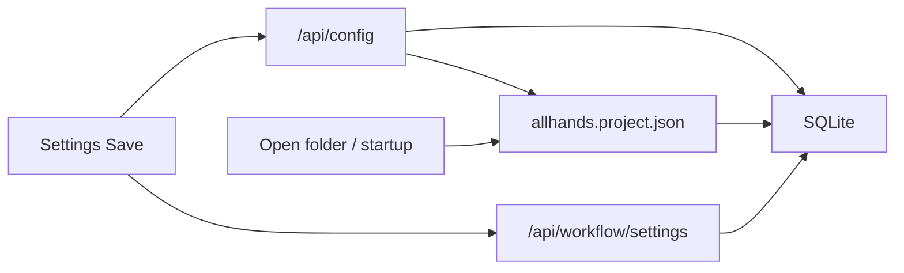

# Persist all settings in allhands.project.json

The file on disk is [`allhands.project.json`](backend/services/project_file.py) (existing name; not `allhand.project.json`). One file per opened workspace folder.

## Why models keep coming back as gemma-4

Code defaults are llama3/qwen, not gemma. gemma-4 is whatever was last **written into the sidecar**. Two bugs make that stick:

1. **Sidecar is stale.** Role models persist via `POST /api/config` → [`save_current_project_state`](backend/services/project_service.py) (SQLite **and** sidecar). MCP, prompts, permissions, tool allowlists, Discord user IDs, phase models, etc. persist via `POST /api/workflow/settings` → [`save_workflow_settings`](backend/services/workflow_settings.py), which **only writes SQLite** (`settings.workflow:{projectId}`). The sidecar is not updated.

2. **Open folder / startup always restores from the sidecar.** [`open_workspace_folder`](backend/services/workspace_open.py) → [`restore_project_from_file`](backend/services/project_file.py) overwrites the SQLite project row (including `po_model`…`qa_model`) from the file. [`bootstrap.initialize`](backend/bootstrap.py) does this on every launch. If the file still has gemma-4, the UI snaps back even after a successful config save that only lived in SQLite (or after a sidecar write that was swallowed by `except Exception: pass` in `save_current_project_state`).

New empty folders also **inherit the previous project's live `agent_*.model`** in [`ensure_project_sidecar`](backend/services/workspace_open.py), so gemma can be copied into a fresh workspace.

## Canonical payload (already mostly there)

Keep format `allhands-project` v2. The file already stores identity, skills, role models/backups, plan/brief, and nested `workflow_settings` (MCP, `agentPrompts`, `agentTools`, `requireToolApproval`, `commandAllowlist`/`Denylist`, `discordBotAllowedUserIds`, sampling, phase models, … — the full [`DEFAULT_WORKFLOW_SETTINGS`](backend/services/workflow_settings.py) / [`WorkflowSettingsPayload`](backend/api/schemas.py) blob).

Also write **`skills_dir`** into the sidecar (today it is only a global SQLite key) and restore it when opening that folder.

**Secrets stay redacted** in the file (`llmApiKey`, `qdrantApiKey`, `discordBotToken`, `phoneNotifyDiscordWebhookUrl`). Restoring must keep existing SQLite secret values when the file has blanks (already how `save_workflow_settings` pops empty secret keys). Board/cards stay out of v2 (SQLite + `docs/tasks`).

## Implementation

### 1. Write the sidecar whenever settings change

In [`save_workflow_settings`](backend/services/workflow_settings.py) (and `reset_workflow_settings` / `restore_agent_prompt_overrides`), after SQLite write, call [`write_current_project_file()`](backend/services/project_file.py) when `project_id` is the current project (and the matching workspace write when restoring another id). Same for `/api/config` path: it already goes through `save_current_project_state`.

Replace silent `except Exception: pass` around sidecar writes in [`save_current_project_state`](backend/services/project_service.py) with logging so a failed disk write cannot look like a successful save.

### 2. Load and apply from the file

[`restore_project_from_file`](backend/services/project_file.py) already copies models/skills/brief and, if present, `workflow_settings`. Tighten this so:

- Models/backups from the file always win on open (source of truth).
- Non-empty `workflow_settings` always replace the SQLite workflow blob for that project (merge with defaults as today).
- `skills_dir` from the file is applied to `state.SKILLS_DIR` / the `skills_dir` setting.
- After [`load_project_into_state`](backend/bootstrap.py), keep existing `configure_agent_tools` / `configure_agent_prompts` / MCP registration so loaded settings are live, not just stored.

Seed **new** sidecars from `state.PRIMARY_MODELS` (not a possibly swapped `agent.model`), falling back to the llama3/qwen registry defaults — do not copy another folder’s gemma into a brand-new workspace.

### 3. Unit test

Add [`tests/test_project_settings_sidecar.py`](tests/test_project_settings_sidecar.py) (pytest, tmp workspace):

1. Set distinct role models (not gemma-4) + backups.
2. Save workflow settings covering MCP (`mcpServers`), prompts (`agentPrompts`), permissions (`requireToolApproval`, `toolApprovalTools`, `commandAllowlist`, `discordBotAllowedUserIds`), and `agentTools`.
3. Assert `allhands.project.json` contains those exact values (and no secret values).
4. Wipe the SQLite project row **and** `workflow:{id}` setting.
5. `restore_project_from_file` + `load_project_into_state`.
6. Assert models, MCP, prompts, permissions, and tool allowlists are restored on the project row, workflow blob, and `state.PRIMARY_MODELS`.

Optional second case: `POST /api/workflow/settings` updates the sidecar without going through `/api/config`.

No frontend autosave change; explicit Save still applies. After this, that Save will keep the file in sync so restart/open-folder cannot resurrect gemma-4.