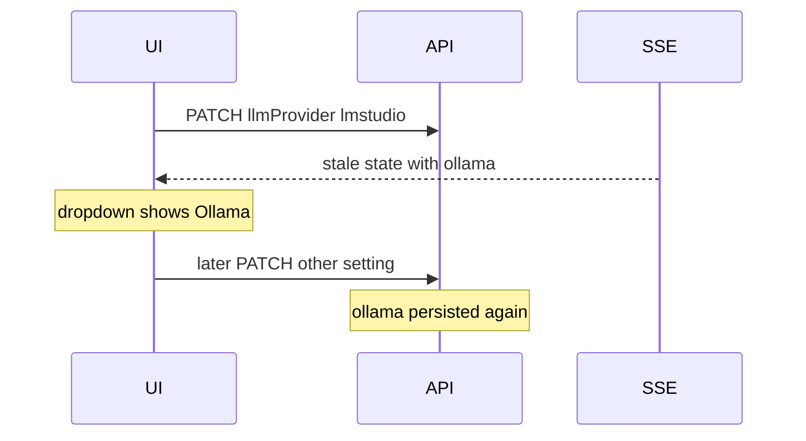

# Persist LM Studio and recover cards

Two separate problems share the same settings/board persistence layer.

## Why the provider snaps back to Ollama

The Models dropdown is bound to `workflowSettings.llmProviderPreset` and falls back to `'ollama'` when that field is missing ([SettingsSlideOver.tsx](frontend/src/components/SettingsSlideOver.tsx)). Changing it **does** queue a PATCH to `/api/workflow/settings` (350ms debounce in [App.tsx](frontend/src/App.tsx)). That is **not** what **Save Custom Configurations** writes — that button only posts project name, workspace, skills dir, and models via `/api/config` ([projects.py](backend/api/projects.py)).

After a successful settings save, a **stale SSE `state` event** can still apply an older `workflowSettings` blob. The pending overlay is cleared on save success ([workflowSettingsPending.ts](frontend/src/workflowSettingsPending.ts)), so the UI shows Ollama again. The next unrelated workflow PATCH can then **write Ollama back to the DB**.

**Save status for this debounce only appears on the Workflow tab**, not Models, so it looks like LM Studio never saved.

## Why snapshots are bunched and empty

Every `save_current_project_state()` writes a new file under `~/.allhands/board_snapshots/{projectId}/` ([project_service.py](backend/services/project_service.py) → [board_snapshots.py](backend/services/board_snapshots.py)). Sprint/tool activity persists constantly. Only **10** files are kept, named to the **second**. Rapid saves replace the same second and prune older full boards. After a wipe, the remaining 10 are all near-empty and close in time.

Recovery UI already exists: Settings → General → **Board recovery** ([BoardRecoveryPanel.tsx](frontend/src/components/BoardRecoveryPanel.tsx)). Candidates with **more cards than live** still help if an older snapshot survived prune.

## Can we rebuild from `docs/tasks`?

**Not today.** [task_spec_markdown.py](backend/services/task_spec_markdown.py) says the **card JSON is source of truth**; `docs/tasks/{id}-spec.md` is generated from the card. There is no import path. Specs still contain enough to rebuild a usable card: id, title, status/lane, work type, description, user story, AC, scope, test plan, dependencies.

This is a partial restore (no transcripts, phase graphs, or latch flags). Prefer a richer snapshot first when one exists.

---

## Implementation

### 1. Keep LM Studio selected and persisted

- On Models tab, show the same saving / error line used on Workflow.
- After a successful workflow save, bump a client **settings generation** (or timestamp). Ignore `workflowSettings` on SSE/`applyState` when the payload is older than that generation (or simply **never replace `llmProvider` / `llmProviderPreset` / `llmBaseUrl` from SSE** unless the event came from the settings POST itself).
- When applying incoming settings, if `llmBaseUrl` looks like LM Studio (`:1234` or `/v1`) and preset is missing/ollama, **infer `lmstudio` / `openai_compat`** (same idea as [llm_provider.infer_provider_from_url](backend/services/llm_provider.py)).
- Include `llmProvider`, `llmProviderPreset`, and `llmBaseUrl` in `/api/config` (or have Save Custom Configurations also PATCH workflow settings) so that button actually keeps the provider.
- Regression: save LM Studio → apply a stale SSE state snapshot → dropdown stays LM Studio; a later `ollamaNumCtx` PATCH must not write provider back to ollama.

### 2. Snapshots that survive a wipe

In [board_snapshots.py](backend/services/board_snapshots.py):

- Filename with milliseconds (avoid same-second overwrite).
- Do **not** snapshot on every persist. Write when task count changes, on a cooldown (e.g. 2–5 minutes), and **immediately before** destructive ops (`clear_all_board_tasks`, `/api/reset`, restore).
- Keep last **N diverse** snapshots: always retain the most recent **non-empty** boards (by task count), not only the newest 10 files. Skip writing if identical to the last snapshot.
- Surface **all** snapshots in Board recovery (not only “richer than live”), with task counts, so a slightly older full board is one click.

### 3. Import cards from `docs/tasks`

- Parse `*-spec.md` from the workspace (`WORKSPACE_DIR/docs/tasks`) and VFS.
- Map **Status** → lane; `init_new_task` + place on board; skip ids already present unless overwrite.
- Attach `*-qa.md` paths when present.
- API + Board recovery button: **Rebuild board from docs/tasks**.
- Tests with a fixture spec file → cards reappear in the right lane.

### 4. What you can do before this ships

- Settings → **Models**: pick LM Studio and wait for save (do not rely on Save Custom Configurations).
- Settings → **General** → Board recovery: tick overwrite, restore the snapshot with the highest card count.
- If every snapshot is empty, `docs/tasks` on disk is the fallback once import lands; those files survive `/api/reset` only if they were on disk outside a wiped workspace walk — confirm they still exist in the project workspace before depending on them.
