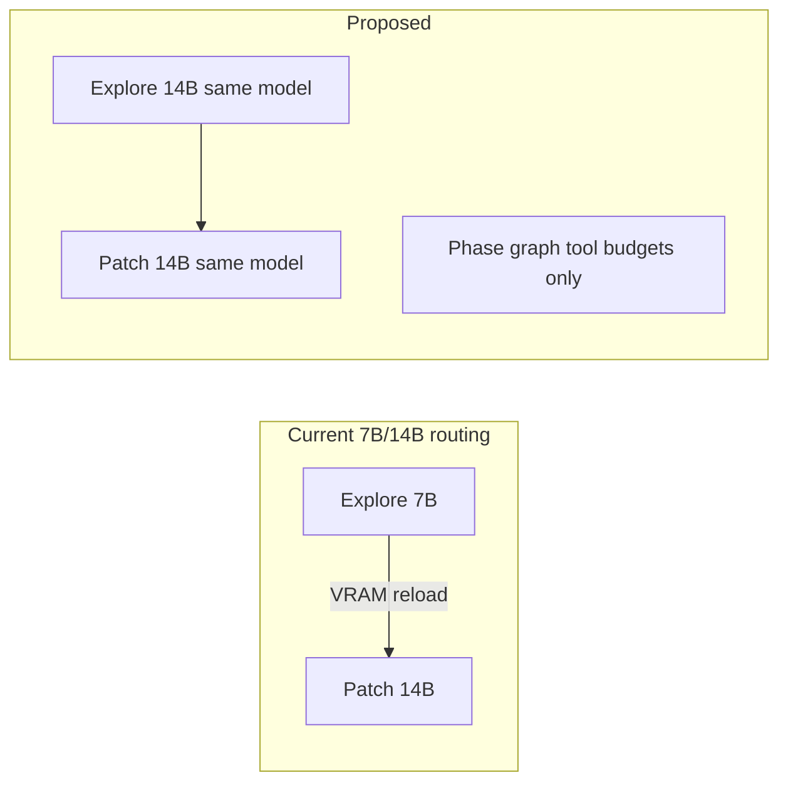

# Quality-First Model Tuning (RTX 3060 12GB)

## What we know about your machine

| Signal | Value |
|--------|-------|
| GPU | **NVIDIA GeForce RTX 3060** |
| VRAM | **12288 MiB (~12 GB)** |
| Ollama | Local (`localhost:11434`) |
| Project | Node.js meal recipe planner ([`allhands.project.json`](allhands.project.json)) |
| Current primaries | All roles `qwen2.5-coder:7b` |
| Current routing | Explore **7B** → Patch **14B** (`enablePhaseModelRouting: true`) |

With 12GB, the app already treats you as **single-GPU, single-model territory**:

- [`single_model_mode_active()`](backend/services/agent_efficiency.py) auto-engages when probed VRAM **< 16000 MB**
- [`get_model_recommendations()`](backend/services/system_capacity.py) maps 10–16GB to **7B** defaults — tuned for speed, not your stated goal

Your traces with **qwen3.8-27b** (~1.2 tok/s, 8+ min PO steps) match expectations: 27B weights (~16GB+ at Q4) exceed usable VRAM on a 3060, forcing offload/swap and killing throughput without guaranteeing better tool behavior.

**Practical quality ceiling on 12GB:** `qwen2.5-coder:14b` (Q4) as **one loaded model** for all roles.

**27B on 12GB:** viable only as an **experimental** preset — expect partial CPU offload, low tok/s, and aggressive ctx clamping via [`fit_num_ctx()`](backend/services/llm_capacity.py). Worth trying on hard cards, not as the default sprint config.

---

## Recommended strategy: single-model phase graph

Instead of disabling all structure, use **one model + phase graph behavior**:

- **Turn off phase model routing** — no model swap between Explore/Patch/Verify
- **Keep `enableDevPhaseGraph`** — explore/patch/verify *tool budgets* and forced-patch nudge still prevent read-only loops
- **One model:** `qwen2.5-coder:14b` for PO, Dev, CR, QA
- **Quality-oriented workflow knobs** (undo the “Fast first code” lean preset where it hurts quality):
  - `promptProfile: full` (not `local_slm`)
  - `maxLlmIterationsPerStep: 30` (not 6)
  - `ollamaNumCtxAdaptiveStart: 8192` (14B fits at Q4 with q8_0 KV on 12GB better than 27B)
  - Keep `devExploreMaxTools: 8` but consider **`devExploreForcePatchInStep: false`** so explore isn’t cut off before the 14B model has enough context

This is “cleverer than A” because you keep sprint guardrails without paying reload tax.

---

## Optional: 27B experimental preset (your “try D”)

Add a second preset **“Quality max (27B experimental)”** that:

- Sets all primaries to your installed 27B tag (e.g. `qwen/qwen3.8-27b:latest` or a Q4 variant)
- Forces `singleModelMode: on`, `enablePhaseModelRouting: false`
- Sets `ollamaNumCtxAdaptiveStart: 6144`, `llmHostVramMb: 12288`
- Surfaces a UI hint: *“12GB GPU — expect slow generation; use for hard cards only”*

Do **not** make this the default; use it to A/B one difficult task vs 14B.

---

## Files to change

### 1. Project sidecar — immediate runtime effect

[`allhands.project.json`](allhands.project.json):

- `po_model`, `dev_model`, `cr_model`, `qa_model` → `qwen2.5-coder:14b`
- `workflow_settings`:
  - `enablePhaseModelRouting: false`
  - `singleModelMode: "on"` (explicit; don’t rely on auto probe alone)
  - `llmHostVramMb: 12288`
  - `devExploreModel` / `devPatchModel` → remove or set both to `qwen2.5-coder:14b` (normalization already drops empties)
  - `promptProfile: "full"`
  - `devExploreForcePatchInStep: false` (quality explore room)
  - Keep `agentEfficiencyMode: "high"` and dev phase graph enabled

### 2. Frontend preset — one-click apply + 27B experimental

[`frontend/src/components/WorkflowPanel.tsx`](frontend/src/components/WorkflowPanel.tsx) — add presets alongside `fast-dev`:

| Preset | Purpose |
|--------|---------|
| **Quality single model** | 14B, routing off, full prompts, balanced iterations |
| **Quality max (27B experimental)** | 27B single model + VRAM warning hint |

Also sync [`frontend/src/types/index.ts`](frontend/src/types/index.ts) `DEFAULT_WORKFLOW_SETTINGS` only if we want new installs to default quality-neutral (optional; project sidecar is the main lever).

### 3. Settings visibility (small UX)

In WorkflowPanel Ollama section, when probed/`llmHostVramMb` ≤ 12288:

- Show inline note: *“12GB detected — single-model 14B recommended; 7B/14B phase routing causes reloads.”*
- Optionally wire existing [`GET /api/ollama/model-recommendations`](backend/api/ollama.py) to display tier + `singleModelRecommended`.

### 4. Backend — no routing logic rewrite needed

Existing code already supports this config:

- [`resolve_step_model()`](backend/services/agent_efficiency.py) skips dev phase routing when `enablePhaseModelRouting` is false or `phase` is unset
- [`apply_model_for_step()`](backend/services/backup_model.py) uses primary + heavy-primary fast path only when primary is a heavy general model

No change required unless we add a dedicated `qualityPresetVersion` migration key (optional).

---

## Validation checklist

After backend restart + project reload:

| Trace signal | Expected (14B default) |
|--------------|-------------------------|
| Model on PO/Dev steps | `qwen2.5-coder:14b` throughout |
| `modelRouteReason` | `single_model` or `role_primary` — **not** `phase_explore` |
| Phase graph | Still shows Explore/Patch/Verify **tool counts**, no model change between phases |
| PO `numPredict` | ≤ 1024 (unless you enable `poNumPredictOverride`) |
| PO wall time | Target **< 2–3 min** on 14B vs 8+ min on 27B |
| Dev writes | Phase graph nudges patch after explore budget; fewer duplicate-tool stalls than 7B explore |

For 27B experimental preset: run **one** hard card; compare write success rate vs 14B preset before adopting.

---

## What we are explicitly not doing

- Keeping **7B explore + 14B patch** as default (you rejected this; it’s the main quality bottleneck on 12GB)
- Global backend default change forcing 14B for all users (project preset + sidecar only)
- Automatic Qdrant reindex (unrelated; only needed if embed model changes)
