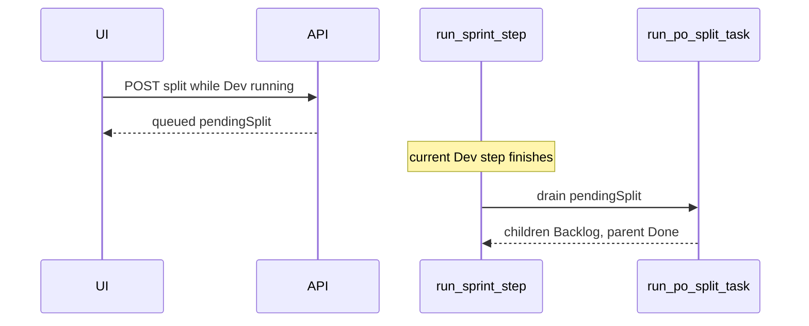

# Queue splits during sprint; auto-split when Dev is stuck

Yes: splits can already happen automatically (`enableSplitOnStuck`, AC chunking on Dev claim, PO `add_backlog_tasks`). What you hit is different: **the Split button is blocked for the whole board whenever any agent step is running**, and **stuck auto-split is skipped** for the exact failure mode in these dumps (explore budget / Forced Patch).

You chose **queue after the current step**. That is the right default: do not tear down a card while Gemma is still writing it.

## Why the dumps did not auto-split

Today’s 23 traces (6 tasks, `gemma-4-q4km:26b`) are mostly explore-without-write, failed `apply_patch`, and ~300s Ollama timeouts. Auto-split in [`_check_stuck_and_escalate`](backend/services/sprint_service.py) **explicitly skips** those cases:

```1187:1193:backend/services/sprint_service.py
    if (
        ws.get("enableSplitOnStuck", True)
        and not task.get("splitAttemptedOnStuck")
        and not stuck_is_tool_or_lint(task)
        and not explore_no_write
        and not latched
    ):
```

`explore_no_write` is skipped so the next Dev step can Forced Patch. In the dumps that next step still explored, emitted empty tools, or hard-stopped on one `apply_patch` fail. `TASK-A3AA7…` then hit `phase_cycle_cap` (`latched`) and auto-split was skipped again. So the cards you wanted smaller **never** took the stuck-split path.

Parents like StoreRepository tests / Edit Store Form going Needs PO → Done with `(1/2)` `(2/2)` children is the existing PO/AC split path — not the blocked UI button.

## 1. Queue Split while a sprint step is running

**API** [`POST /api/tasks/{task_id}/split`](backend/api/board.py): stop returning HTTP 409 when `get_active_run()` is set.

- If **no** active run: keep current immediate `run_po_split_task()` (do **not** hold `STATE_LOCK` across the PO LLM call — today the whole split runs inside the lock; release after the existence/Done checks).
- If **an** active run: set `pendingSplit` on the task (`requestedAt`, optional `guidance`, `requestedBy: "ui"`), persist, publish board update, return `{ queued: true, splitResult: { added: 0, queued: true } }` immediately. Reject only Done cards (unchanged).

**Drain** after each sprint step, once `finish_run()` has cleared the active run — at the end of [`run_sprint_step`](backend/services/sprint_service.py) (and the same place auto-sprint loops between steps). Drain **all** `pendingSplit` cards, not only the card that just ran.

For a queued **In Progress** parent: run `run_po_split_task`, retire parent to Done (`splitSuperseded`), children on Backlog. Do not start another Dev step on that parent.

**UI** [`TaskDetailModal.tsx`](frontend/src/components/TaskDetailModal.tsx) / [`App.tsx`](frontend/src/App.tsx):

- Enable Split while `sprintRunning`.
- Tooltip / notice: “Queued — will split after this step finishes.”
- If already queued, disable or show “Split queued”.



## 2. Auto-split after Forced Patch fails (what the dumps needed)

Keep skipping auto-split on the **first** explore-budget so Forced Patch still gets one shot.

Change the skip so auto-split **does** run when any of:

- `forcePatchNextDevStep` was already consumed / last step was Forced Patch and still no successful write
- last exit is `patch_budget_exhausted` / hard `apply_patch` stop with no write
- `pendingSplit` is set (queued UI request counts as the split attempt)

Do **not** skip solely because `phaseCycleCapReached` if `enableSplitOnStuck` is on and split has not been attempted — split **instead of** latching Auto Sprint, matching the StoreRepository `(2/2)` trace.

Still skip lint/tool walls (fanout already exists) unless the user queued a manual split.

Reuse existing `run_po_split_task` + `splitAttemptedOnStuck`. Extend [`tests/test_stuck_split_recovery.py`](tests/test_stuck_split_recovery.py) and add an API test that an active run queues instead of 409.

## 3. Improvements from this execution (tightly related)

Land the already-in-tree Ollama work separately if needed ([`docs/specs/ollama_timeout_no_retry_2c542e0b.plan.md`](docs/specs/ollama_timeout_no_retry_2c542e0b.plan.md)): **do not retry timeouts**, default **900s**, Console “Still waiting for Ollama…”. Traces show stacked ~301s timeouts (`TASK-622BF…` T183954).

In this same split/stuck change, fix outcome labeling that blocked recovery:

- Intentional **write + duplicate-test skip** stops (`T185901`, `T191543`, `T193257`) are still `ok=False` / `tool_failure_stop`, which inflates `consecutiveBadExits` and can latch cards. Treat those as a **successful step stop** (`ok=True`, do not increment bad exits) so Auto Sprint continues or split can run cleanly.

Out of scope here (follow-up): scoping `flutter analyze` away from the ~150 baseline findings, and making Forced Patch prefer `write_file` after N `patch_failed`. Those are real in the dumps but not required to make split work.

## Files

- [`backend/api/board.py`](backend/api/board.py) — queue vs immediate split; don’t 409; don’t hold lock during PO LLM
- [`backend/services/sprint_service.py`](backend/services/sprint_service.py) — drain `pendingSplit`; relax stuck auto-split skips
- [`backend/services/board_service.py`](backend/services/board_service.py) / task normalize — persist `pendingSplit`
- [`frontend/src/components/TaskDetailModal.tsx`](frontend/src/components/TaskDetailModal.tsx), [`frontend/src/App.tsx`](frontend/src/App.tsx), types — enable button + queued copy
- Tests: stuck recovery, split API while `start_run()` is active, drain after a fake sprint step
