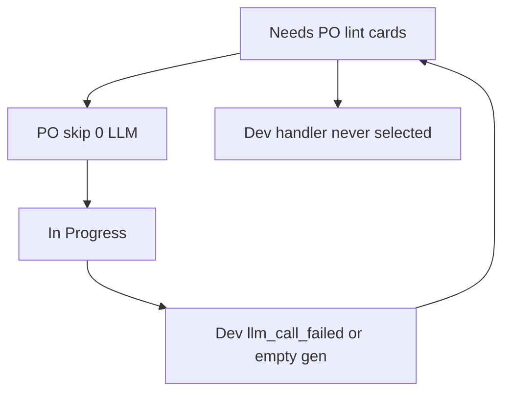

# Scrum bounce fix + optional implementer profile

## Verdict: these traces are not improving

All 9 traces at **19:30** are the same shape:

- Agent **Product Owner**, `exitReason: po_clarified`, `ok: true`
- `ollamaCallCount: 0`, `writesSucceeded: 0`
- Event `po_llm_skipped: spec present; last_exit=llm_call_failed`
- Snippet: *Moved to In Progress without a PO generate*
- Titles are **Lint:** fanout, including **`~/.pub-cache/.../sqflite_common`** (not your app)

Visit-cap auto-split is **not** in this set. The hour of “work” is **Needs PO skip → In Progress**, because [`run_sprint_step`](backend/services/sprint_service.py) **always prefers Needs PO over Developer**. A queue of lint cards with a spec never needs an LLM, so Auto Sprint never reaches `_run_developer_step`. Cards do not get built.

Matching Cursor IDE token-for-token is not possible (different product, cloud models). Matching **Cursor’s useful property** is: most steps **edit workspace files** and **advance cards**. Scrum stays the default; implementer is an explicit option.

## 1. Fix Scrum (required)

**Prefer Developer when PO would skip.** In [`run_sprint_step`](backend/services/sprint_service.py): if `_in_progress_dev_runnable()` is non-empty **and** the Needs PO card would `should_move_off_needs_po_without_llm`, run **Dev first**. Still run real PO LLM when the spec is missing.

**Same-step handoff.** After a successful PO skip ([`_run_po_clarification`](backend/services/sprint_service.py) ~3751), if destination is In Progress, immediately `_run_developer_step` on that card (one sprint tick = skip + write, not skip-only).

**Do not fan out junk lint.** In [`lint_fanout.py`](backend/services/lint_fanout.py), drop diagnostics whose path contains `.pub-cache`, `pub.dev/hosted`, `site-packages`, `node_modules`, or is outside [`WORKSPACE_DIR`](backend/state.py). Keep in-card budget for real project files. At sprint start (or fanout), **Done** existing open `Lint:` cards whose `lintSourceFile` / title is junk so they stop occupying Needs PO.

**Stop llm_call_failed → Needs PO ping-pong.** If last exit is `llm_call_failed` / `empty_generation_timeout` and the spec is already present, stay In Progress (Forced Patch) instead of Needs PO. PO skip remains for genuine missing specs.

Tests: handler picks Dev when skippable Needs PO + runnable In Progress; fanout ignores pub-cache; PO skip then Dev is invoked in one `_run_po_clarification` path.

## 2. Optional Cursor-like implementer (keep Scrum)

New workflow setting `executionProfile`: `"scrum"` (default) | `"implementer"`. Wire [`workflow_settings.py`](backend/services/workflow_settings.py), [`schemas.py`](backend/api/schemas.py), [`WorkflowPanel.tsx`](frontend/src/components/WorkflowPanel.tsx) (radio next to Autonomous), [`types/index.ts`](frontend/src/types/index.ts).

When `implementer`:

- Sprint handler: **Dev (then QA)** only. Skip PO clarification unless description/AC empty.
- Disable lint fanout (`maxLintFanoutCards` treated as 0).
- Prompt: single implementer — read the named file, `apply_patch`, run project lint/test, repeat until green or step budget. No “ask PO”.
- Cards still move Backlog → In Progress → QA → Done. CR stays behind `requireCodeReview`.

Scrum path unchanged when profile is `scrum`.

## 3. Out of scope

Do not rewrite Ollama HTTP client in this change (client-closed is still a follow-up). Do not edit the Reports or auto-split plan files.

After this ships: restart backend, set **Implementer** if you want Cursor-like spend; leave **Scrum** if you want roles, with bounce/junk-lint fixed either way.
