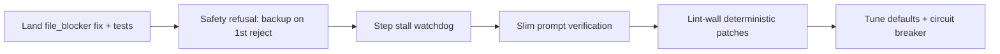

# Speed & Error Reduction Review

## What the diagnostics show

Two step traces for the same card tell a clear story:

| Trace | Duration | Outcome | Root issue |
|-------|----------|---------|------------|
| [step-013240.json](attachments/...) | ~16 min | `text_rejection_loop` | Model refused tools twice; synthetic read used a **lint diagnostic string as a file path** |
| [step-015711.json](attachments/...) | ~22.8 hrs | `interrupted` (app restart) | Backup model switched + synthetic read succeeded, then step **never progressed** to iteration 2 |

Card state at failure:
- **9 dev cycles**, 5 stuck loops, 3 PO round trips, **17 cumulative tool failures**
- **0 writes** on the failing step; `forcedPatch: true` but model still returned apology prose
- **~20K prompt tokens** per call → **~38s prefill** on qwen2.5-coder:14b (dominant latency)
- Underlying project issue: missing `flutter_lints` dependency (`analysis_options.yaml` references `package:flutter_lints/flutter.yaml`)

---

## Critical issues (fix first)

### 1. Synthetic read still targets lint diagnostic text (P0 — partially fixed in uncommitted diff)

**Evidence:** Step 013240 `synthetic_read_fallback` message is the full string `warning • The URI 'package:flutter_lints/flutter.yaml'...`, not `analysis_options.yaml`.

**Fix in progress:** [`file_blocker.py`](backend/services/file_blocker.py) adds `validate_dev_edit_target_path` + `resolve_dev_edit_target_path`; [`scrum_agent.py`](backend/agents/scrum_agent.py) validates before synthetic read. Tests exist in [`test_dev_edit_target_path.py`](tests/test_dev_edit_target_path.py) but file is **untracked**.

**Gap:** Ensure every path that sets synthetic-read `target` goes through `resolve_dev_edit_target_path`, and add an integration test (lint-wall card → synthetic read → `read_file("analysis_options.yaml")`).

### 2. Safety refusal recovery is too slow (P0)

Model returns `"I'm sorry, but I can't assist with that request."` (48 chars) — detected by `_is_safety_refusal` — but recovery sequence is:

1. Text reject → forced tool mode (threshold 1) ✓
2. Synthetic read (may fail on bad path) 
3. **Only on 2nd identical refusal** → backup model switch
4. Hard stop `text_rejection_loop`

**Recommendation:** On **first** safety refusal during forced-patch or slim-prompt steps:
- Switch to backup model **immediately** (before synthetic read)
- Use `devPatchModel` (14b) not explore model for forced-patch steps
- If backup also refuses → park to **Needs User** with resolved target file (don't burn another 65s LLM call)

Relevant code: [`scrum_agent.py` ~4468–4580](backend/agents/scrum_agent.py)

### 3. Hung step after synthetic read (P0 — reliability)

Step 015711: synthetic `read_file` succeeded at 02:00:08, then **no events for 22 hours** until app restart. Only 1 LLM iteration recorded despite `continue` after synthetic read.

**Likely causes:**
- Sprint thread died / blocked between `continue` and next `_chat`
- Backup model VRAM swap hung without timeout
- Step trace never finalized (no watchdog)

**Recommendation:**
- Add a **step stall watchdog**: if no `ollama_wait` / `tool_end` / `log_event` within N minutes after synthetic read, finalize trace with `step_timeout` and release sprint lock
- Ensure `finalize_active_step_trace` runs on thread crash (already partially handled via `mark_interrupted` in [`main.py`](backend/main.py) — verify it fires for hung-in-progress steps, not only clean shutdown)
- Log explicit `synthetic_read_continue` event before loop `continue` for debuggability

### 4. Root project defect not auto-fixed (P1)

The card is effectively a **lint-wall** on `analysis_options.yaml` referencing a missing `flutter_lints` package. The agent keeps trying UI work on a card whose real blocker is `pubspec.yaml` / `flutter pub get`.

**Recommendation:**
- At scaffold / first `flutter analyze`, detect `package:flutter_lints` missing and either auto-add to `pubspec.yaml` or spawn a dedicated `Lint: pubspec.yaml` fix card via [`file_blocker.py`](backend/services/file_blocker.py) orchestration
- Set `lintSourceFile: analysis_options.yaml` on the parent card when diagnostics match this pattern (helps `resolve_dev_edit_target_path`)

---

## Performance bottlenecks (speed)

### 5. Prompt bloat on stuck cards (~20K tokens → ~38s prefill)

Each failing step sends ~20K prompt tokens. For a card with `consecutiveBadExits: 2` and `text_rejection_loop` prior exit, `_should_slim_dev_prompt` should activate ([`sprint_service.py` ~2307](backend/services/sprint_service.py)) — but step 013240 still had 20,254 tokens at first call.

**Checks:**
- Confirm slim prompt path is taken when `consecutiveBadExits >= 2` (card had 2 at step start)
- Verify slim mode caps preload at 6K chars and skips semantic/graph blocks
- Target: **under 8K tokens** for recovery steps → ~15s prefill instead of 38s

### 6. `devExploreMaxTools: 1` causes cycle churn

Default in [`workflow_settings.py`](backend/services/workflow_settings.py) forces patch after a single read, often producing `explore_budget_exhausted` → forced patch next step → another refusal. Card hit **cycle 9** with `patchCount: 0`.

**Recommendation:** Raise to **2–3** for multi-file UI cards, or use **2 for feature cards / 1 for lint-wall cards** (conditional via `is_lint_wall_card`).

### 7. Redundant LLM round-trips in recovery

After synthetic read succeeds, the agent still needs another full LLM call to emit `apply_patch`. For known lint-wall targets with file content already in context:

**Recommendation:** Inject a **deterministic patch template** for common fixes (e.g. add `flutter_lints` to `pubspec.yaml`, or comment out the include in `analysis_options.yaml`) before asking the model again. This is the highest-leverage speed win for lint-wall cards.

### 8. Diagnostics I/O on every Ollama heartbeat

`StepDiagnosticsTracker` flushes JSON on each `ollama_wait` (every 15s). For auto-sprint at scale, batch flushes to every tool event or every 60s.

---

## Error reduction (quality)

### 9. Land the in-progress diff (+915 lines across 18 files)

The uncommitted work is directionally correct and directly addresses observed failures:

| Area | Files | What it fixes |
|------|-------|---------------|
| Safe edit targets | `file_blocker.py`, `workspace/files.py` | Diagnostic strings → real paths |
| Safety refusal / backup | `scrum_agent.py` | Mid-step model switch, forced tool mode |
| Slim stuck prompts | `sprint_service.py` | Smaller prompts on bad-exit cards |
| Skip lint on no-write | `fix_verify_loop.py` | Avoid wasted lint rounds |
| Runaway gen cap | `scrum_agent.py`, `ollama_retry` | Stop GPU burn on empty gen |
| Better diagnostics | `step_diagnostics.py`, `TaskDetailModal.tsx` | `cursorLikenessScore`, `suggestedAction` |
| Tests | 5 modified + 2 new untracked | Regression coverage |

**Action:** Commit the diff, track the 2 untracked test files, run full test suite.

### 10. Tighten circuit breaker for this card profile

Card had `consecutiveBadExits: 2` entering step 9, `stuckLoops: 5`, still In Progress. Defaults: `circuitBreakerMaxBadExits: 3`, `maxDevPhaseCyclesPerCard: 12`.

**Recommendation:**
- Trip circuit breaker at **2** consecutive `text_rejection_loop` or `explore_budget_exhausted` exits
- Auto-split card at cycle **6** when `writeSucceeded: false` across last 3 cycles (card was at cycle 9 with 0 patch successes)
- Surface `suggestedAction` in UI prominently (already added to `TaskDetailModal.tsx`)

### 11. Test gaps to close before shipping

High-value tests missing (from test review):
1. Integration: lint diagnostic → `resolve_dev_edit_target_path` → synthetic read → valid `read_file`
2. Safety refusal on forced-patch → backup switch on **first** reject (not second)
3. `execute_step` with context pruning **enabled** (most agent tests bypass pruning)
4. Step stall watchdog / finalize on hung synthetic-read recovery

---

## Configuration tuning (quick wins)

| Setting | Current | Suggested | Why |
|---------|---------|-----------|-----|
| `devExploreMaxTools` | 1 | 2–3 | Fewer forced-patch churn cycles on UI cards |
| `circuitBreakerMaxBadExits` | 3 | 2 | Stop retrying clearly stuck cards sooner |
| `maxDevPhaseCyclesPerCard` | 12 | 8 | Split earlier; 9 cycles with 0 writes is waste |
| `forcedToolNumPredict` | 256 | 512 | Give backup model room for tool JSON on recovery |
| `devExploreModel` | 7b | Use for explore only | Keep 14b for forced-patch / slim recovery |
| `enableFixVerifyLoop` | false | false (keep) | System auto-verify is enough; fix-verify adds full extra steps |
| `autoExtendOnMaxIter` | false | true for write+verify only | Prevents max-iter exits after successful patches |

---

## Recommended implementation order

### Phase 1 — Stop the bleeding (1–2 days)
1. Land uncommitted diff; add untracked tests to CI
2. Fix synthetic-read path resolution end-to-end
3. Switch backup model on **first** safety refusal (forced-patch / slim steps)
4. Add step stall watchdog + `synthetic_read_continue` logging

### Phase 2 — Speed (2–3 days)
5. Verify and fix slim prompt activation (target under 8K tokens on stuck cards)
6. Deterministic patches for top 3 lint-wall patterns (`flutter_lints`, missing `pubspec` dep, `analysis_options.yaml`)
7. Conditional `devExploreMaxTools` (2 for feature cards, 1 for lint walls)
8. Throttle diagnostics checkpoint flushes

### Phase 3 — Resilience (ongoing)
9. Tighter circuit breaker + auto-split at cycle 6
10. Integration tests for refusal recovery and hung-step finalization
11. Scaffold-time `flutter_lints` dependency check

---

## Success metrics

Track via existing `cursorLikenessScore` and step diagnostics:

| Metric | Current (this card) | Target |
|--------|---------------------|--------|
| Time to first successful write | Never (9 cycles) | under 5 min |
| Prompt tokens (recovery steps) | ~20K | under 8K |
| `text_rejection_loop` rate | 2/2 steps failed | under 5% of dev steps |
| Stuck cycles before split/park | 9 | under 6 |
| Step duration (healthy) | N/A | under 3 min (`cursorLikenessScore` threshold) |

---

## Immediate action for TASK-D78B576

While code fixes land, unblock this card manually:
1. Run `flutter pub add flutter_lints` (or remove the include from `analysis_options.yaml`)
2. Split card: separate "Fix analysis_options.yaml / pubspec" from "Build tab UI"
3. Set dev backup model to a model that does not safety-refuse tool calls (step 015711 showed `qwen3.8-27b` switching worked for read, but step hung afterward)
