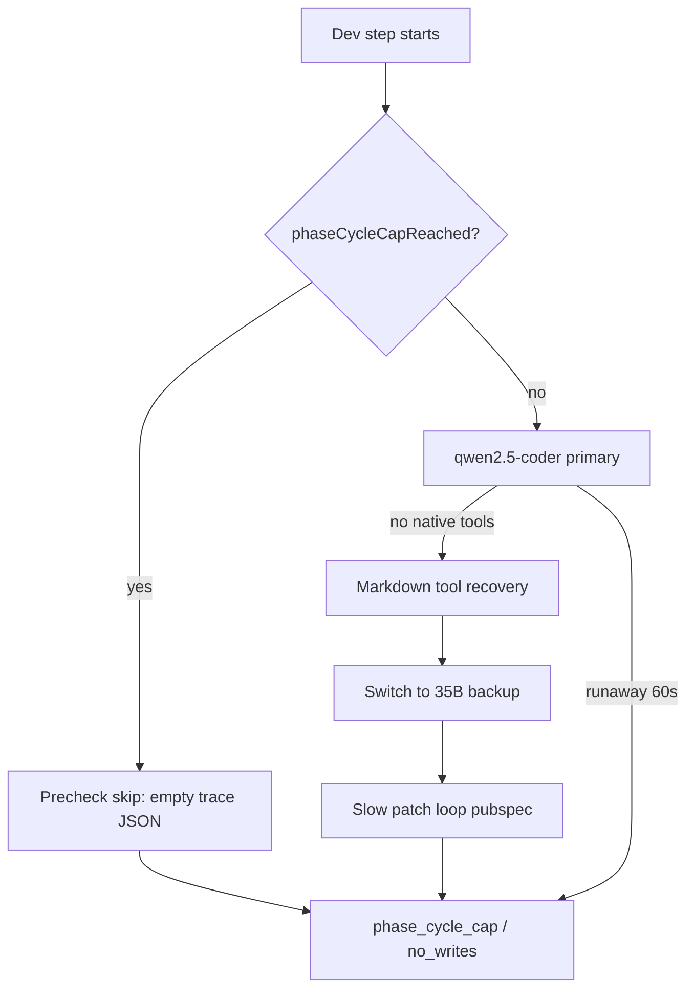

# Speed-first dev pipeline improvements (from step diagnostics review)

## What the traces show

| Pattern | Evidence | Impact |
|---------|----------|--------|
| **Empty “Developer” traces** | ~half of uploads: `durationMs` &lt; 2s, `ollamaCallCount: 0`, `exitReason: phase_cycle_cap` | Cards are **latched** before any LLM runs; sprint still spins JSON files that look “broken” and hide the real last failure in stale `lastStepOutcome.stepProgress`. |
| **Primary model can’t tool-call natively** | e.g. [step-TASK-FD3C…2422](file) — `tool_calls_recovered_from_content` on iter 1 → `backup_model_switched` to `ornith-1.5-35b…` | **~194s Ollama** for 4 iterations; iter 2 alone ~108s (`promptEvalMs: 66555`). |
| **Wrong-file edits** | FD3C title: Widget test / `test/widget_test.dart`; `toolsLog` only **pubspec.yaml** duplicate patches | Wasted iterations; never fixes the card. |
| **Runaway first turn** | [step-TASK-AFE28…0814](file) — 118s, `runaway_generation_aborted`, **zero tools** | Full step burned with no write. |
| **Rare “good” path** | [step-TASK-0A70…4118](file) — `write_file`, lane advance, but **237s / 9 LLM calls**; `cursorLikenessScore` still false (&gt;180s threshold in [`step_diagnostics.py`](backend/services/step_diagnostics.py)) | Success is possible but far from Cursor-like latency. |

**Root insight:** Cursor-like speed needs (1) a **tool-native dev model without a 35B detour**, (2) **hard guardrails on edit target path**, and (3) **latch/cap behavior that doesn’t burn visits when no work runs**.

You chose **speed first**; diagnostics changes below are only what’s needed to verify wins (`timeToFirstWrite`, `primaryBottleneck`).

---

## P0 — Stop wasting GPU on the wrong path

### 1. Do not switch to backup 35B when markdown recovery already worked

Today, first-turn markdown recovery **still** calls `_maybe_switch_backup_on_text_reject` in [`scrum_agent.py`](backend/agents/scrum_agent.py) (~4172–4182), which arms the slow backup for the **rest of the step** even though tools were recovered.

**Change:** Only arm/switch backup when recovery **fails** or the turn is still text-only after recovery. If `recovered_tool_names` is non-empty and tools execute successfully, keep primary (or a **small** dev backup if configured), log `backup_model_skipped_recovery_ok`.

**Files:** [`backend/agents/scrum_agent.py`](backend/agents/scrum_agent.py), optionally [`backend/services/backup_model.py`](backend/services/backup_model.py) (document “fast backup” vs “reasoning backup”).

### 2. Enforce card edit target on `apply_patch` / `write_file`

`resolve_dev_edit_target_path()` in [`file_blocker.py`](backend/services/file_blocker.py) exists but is only used for synthetic read fallback—not to block off-target patches.

**Change:** In tool execution (likely [`tool_execution_service.py`](backend/services/tool_execution_service.py) or pre-flight in scrum agent), when `resolve_dev_edit_target_path(task)` is non-empty and patch path differs:

- **Fail fast** with a short tool error: “This card is scoped to `{target}`; do not edit `{path}`.”
- **Allowlist** when title/diagnostics explicitly scope pubspec/SDK (`pubspec.yaml` in title, `lintSourceFile`, or `fileFixFor`).

This directly addresses FD3C-style pubspec loops on Dart lint cards.

**Tests:** Extend [`tests/test_dev_edit_target_path.py`](tests/test_dev_edit_target_path.py) for off-target `apply_patch` rejection.

### 3. Earlier `write_file` escalation for repeated pubspec patch fingerprints

Identical patch stop already exists ([`scrum_agent.py`](backend/agents/scrum_agent.py) ~3348–3383) but fires after **2** identical failures; traces show **3+** blocked duplicates before stop.

**Change:**

- For `pubspec.yaml` (and paths matching `blocked duplicate` summaries), escalate at **1** repeat when `resolve_dev_edit_target_path` ≠ `pubspec.yaml`.
- On escalate, inject system nudge + optional **deterministic** read→write path (reuse [`lint_wall_recovery`](backend/services/lint_wall_recovery.py) patterns) instead of another LLM turn.

---

## P1 — Faster first useful write

### 4. Tighter runaway handling on Developer iter 1

AFE28 trace: 60s+ wait, abort, no tools, then fix_verify noise.

**Change in** [`scrum_agent.py`](backend/agents/scrum_agent.py) runaway path (~1517, ~1722):

- On first-iteration runaway: immediately enable **forced tool mode** + **synthetic read** on `resolve_dev_edit_target_path` (already partially implemented ~1967+).
- Optionally lower `num_ctx` for iter 1 when slim dev prompt is on (0A70 success used `numCtx: 5120` vs failed steps at 14336+).

### 5. Dev model routing defaults (config + warmup)

**Change:** Workflow/settings or env: treat **tool-calling** as the dev primary requirement.

- If primary is `qwen2.5-coder:14b` and first call needs markdown recovery, **retry same model once** with forced tools before any 35B switch.
- Document recommended stack: small coder with native tools for dev; reserve large model for PO only.

**Files:** [`backend/services/backup_model.py`](backend/services/backup_model.py), [`backend/services/agent_efficiency.py`](backend/services/agent_efficiency.py), settings UI if present.

### 6. Visit cap / latch vs `forcePatchNextDevStep`

Traces show `forcePatchNextDevStep: true` while `phaseCycleCapReached: true` — user sees “Forced Patch queued” but Dev never runs.

**Change in** [`sprint_speed_gates.py`](backend/services/sprint_speed_gates.py) `begin_dev_step` / [`sprint_service.py`](backend/services/sprint_service.py) dev handler (~4867–4895):

- When `forcePatchNextDevStep` and last exit was a **zero-work** precheck (`dev_precheck_skip` / latch-only), **do not** treat as a consumed visit OR call `reset_dev_cycle_latch` for one forced patch attempt (lint/file-blocker cards only).
- Align messaging so UI doesn’t promise retry when latched.

---

## P2 — Lightweight diagnostics (measure speed, not a science project)

Minimal additions in [`step_diagnostics.py`](backend/services/step_diagnostics.py) + [`_record_dev_precheck_skip`](backend/services/sprint_service.py):

| Field / event | Purpose |
|---------------|---------|
| `log_event("dev_precheck_skip", reason)` | Fix empty traces on cap/lint/split skips |
| `performanceSummary.timeToFirstWriteMs`, `backupSwitched`, `markdownRecovery` | Compare before/after on same project |
| Relax or split `cursorLikenessScore` into `fastSuccess` (write + &lt;120s) vs current 180s gate | So 0A70-style wins register |

Reuse [`eval_harness.economics_from_diagnostics`](backend/services/eval_harness.py) in a one-off script or test to score a folder of step JSONs after changes.

---

## Verification (concrete)

1. Re-run the same Flutter board (or [`tests/eval`](tests/eval) golden tasks) and compare:
   - Median `durationMs` for Developer steps with `writesSucceeded > 0`
   - % steps with `backup_model_switched` after markdown recovery
   - Count of `apply_patch` to `pubspec.yaml` on non-pubspec cards
2. Target: **first successful write in &lt;60s** on a single-file lint card with local 14B-class model (no 35B mid-step).
3. Run existing tests: `test_dev_edit_target_path`, `test_smoke` diagnostics/parser, sprint gate tests.

---

## Out of scope (but explains “not like Cursor”)

- Cloud/API models (Cursor’s default) — largest latency/quality gap; can be a follow-up setting.
- Full prompt rewrite — slim dev prompt already enabled in traces; gains are smaller than model routing + path guards.
