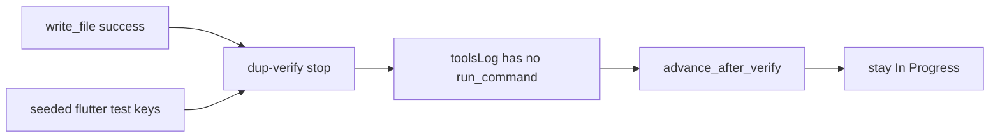

# Review of the new run + diagnostic gaps

Two windows: **old** 01:25–03:40 vs **new** 10:50–12:13 (same `gemma-4-q4km:26b`). The JSON is enough to judge **Ollama-side** changes. It is **not** enough to judge board progress: `lane_advanced`, PO skip, and “why we did not advance” never appear in the step files.

## What the new logs already prove

- **Packed `num_ctx` is live.** Old calls were almost all `32768`. New sampling/`ollamaCalls` are `4096`/`5120` (one `9216`). First-call `promptEvalMs` on delete-tests is ~8s vs ~18s before.
- **Empty-gen abort is live.** New window has **25** `errorType: timeout` calls at ~90–93s and 0 tokens (old had **2** at ~300s). Hung PO/Dev generations die faster.
- **Write+dup stop still fires** (`max_iterations_after_writes` ×3), including “files already written… duplicate skip”.
- Prompt tokens dropped **743k → 80k**; tool time stayed tiny.

## What did not improve (and why the JSON cannot show a win)

- **No `lane_advanced` events.** Cards stayed In Progress. `flutter analyze` still reports **149–154 findings**, so lint-clean advance never applies.
- **False verify-known vs empty tools_log.** Delete-tests 10:59 wrote `test/data/store_repository_test_new.dart`, then stopped as duplicate-verify **without** a `run_command` in `toolsLog`. Stop used **seeded** success keys; [`tools_log_has_verify`](backend/services/duplicate_tool_policy.py) is false, so [`_maybe_advance_dev_after_verify`](backend/services/sprint_service.py) no-ops. Stop without promote.
- **`doneReason: length` / `truncated: true`** at `num_ctx` 5120 (eval ~2.5k tokens). Tight ctx is cutting generations — a new cost, visible only if you open `ollamaCalls`.
- **PO skip did not fire** on the 11:49–12:10 Needs PO cards: 14 PO traces, most 0 tools / ~90s timeout. Only the lint fan-out card called `update_board` (~80s).
- **`whyCardStayed` is stale** (“hit iteration limit” / “text-only”) even after a successful write.

## Logging to add (into the same step JSON)

Emit via existing [`log_event`](backend/services/step_diagnostics.py) so the next dump is countable without Console.

- `lane_advance` / `lane_advance_skipped` — target lane or reason (`no_verify_in_tools_log`, `lint_dirty`, `focus_slice`, `subtasks`, `not_in_progress`).
- `po_llm_skipped` vs `po_llm_started` — why skip failed (missing AC, last exit not write-stop).
- `empty_generation_timeout` — distinct from HTTP timeout; include elapsed + `eval_count`.
- `ctx_truncated` when `doneReason == length`.
- `verify_stop` — whether verify was **this-step tools_log** vs **seeded keys**.
- Fix `whyCardStayed` for `max_iterations_after_writes` so it does not say “text-only”.

## Small behavior fix (otherwise the new logs will still show stay-in-progress)

When the agent stops with the write+dup-verify message, treat that as verify-known for [`_maybe_advance_dev_after_verify`](backend/services/sprint_service.py) (or record a synthetic verify entry on the tools log). Do **not** promote on seeded keys alone if this step never wrote.

Tests: extend [`tests/test_capped_retry_loop_regression.py`](tests/test_capped_retry_loop_regression.py) so write + dup-verify stop advances; add assertions that skip/advance events land in the trace.

No new markdown docs. No canvas unless you want the comparison charted after the next run.
