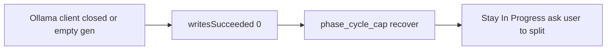

# Diagnostics verdict + Sprint Reports tab

## What the Diagnostics show (auto-split did not run)

These traces are from **18:27–18:37** on that project, with **zero successful writes** on every sampled step. They predate (or ran without) a backend restart after visit-cap auto-split.

**Visit-cap path still the old behavior.** Lint fanout cards at `devStepCount: 13` ended `exitReason: phase_cycle_cap` with snippet *“Stopped: phase cycle cap reached… split the card or reset the latch”* and **stayed In Progress** (no PO split, parent not Done). Examples: `TASK-1BA1C12DF21F4A…` (`Expected to find ')'`), `TASK-1166497AB831…` (`store_repository.dart`), `TASK-1636CA126F634…` (`getDatabasesPath`). That is exactly the latch-recover path we changed in code; these files do **not** show the new auto-split succeeding.

**The sprint was failing earlier than the latch.** Several Developer/PO steps burned retries on `Cannot send a request, as the client has been closed.` (`llm_call_failed`) and one Dev step hit `Ollama empty generation timed out after 90s`. Auto-split cannot fix a dead HTTP client: no tools, no patches, then the visit cap fires.

**Junk lint cards.** Titles targeting `~/.pub-cache/.../sqflite_common.../sqlite_api.dart` are third-party analyzer noise; splitting those is the wrong recovery.

**Conclusion:** The attached Diagnostics **do not** show the visit-cap change helping or failing in production. They show the **pre-fix latch skip** plus a **separate Ollama-client failure**. After restart, expect latched lint to auto-split (or bulk **Split N visit-cap cards**). Client-closed / empty-gen is a follow-up, not this Reports work.

## Reports tab (what you asked for)

Today [`_build_sprint_summary`](backend/services/sprint_service.py) only snapshots **end-of-sprint IDs** (`completed` / `qaFailed` / `blocked` counts) into `lastSprintSummary`, shown in a thin SlideOver. It does **not** record *who moved where* during the run.

Add a **Reports** bottom tab (Work group, next to Activity) that shows the current sprint (live) plus recent finished sprints.

### Record moves during a sprint

New helper [`backend/services/sprint_report.py`](backend/services/sprint_report.py):

- `begin_sprint_report()` when Auto Sprint / a multi-step run starts (same place [`SPRINT_PROGRESS_STEP`](backend/services/sprint_service.py) is reset). Snapshot per-lane counts.
- `record_lane_move(task_id, title, from_lane, to_lane, source)` from [`move_board_stage`](backend/services/board_service.py) and Blocked-lane [`_move_task_to_lane`](backend/services/blocked_lane.py) (unblocks never go through `move_board_stage`).
- Ignore no-ops (`from == to`).
- `finalize_sprint_report(steps, status)` from [`_build_sprint_summary`](backend/services/sprint_service.py): compute rollups, prepend onto a persisted list (`sprint_reports:{projectId}`, cap ~20).

Each report:

- `startedAt` / `endedAt` / `status` / `stepsRun`
- `moves`: `{ taskId, title, fromLane, toLane, source }`
- Rollups: `movedCount`, `byTransition` (e.g. `In Progress → Done: 3`), `unblocked` (from `Blocked`), `splitParents` (`source` split / `splitSuperseded` if easy to detect), `needsUserIn` / `needsUserOut`, `laneCountsStart` / `laneCountsEnd`

Expose `sprintReports` + `currentSprintReport` on `/api/state` via [`build_state_response`](backend/api/helpers.py). Types in [`frontend/src/types/index.ts`](frontend/src/types/index.ts).

### UI

- New tab id `reports` in [`App.tsx`](frontend/src/App.tsx) (`BottomTab` + `bottomTabs`).
- New [`frontend/src/components/SprintReportsPanel.tsx`](frontend/src/components/SprintReportsPanel.tsx): current session (or “no sprint yet”) with counts + move list; history list of past reports. Keep the existing end-of-sprint SlideOver as-is (or one-line “Open Reports”).

### Tests

- Move In Progress → Done and Blocked → Backlog while a report is open; finalize; assert `unblocked == 1` and the transition counts.
- State payload includes `sprintReports`.

Do not edit the attached auto-split plan file. Do not tackle Ollama “client has been closed” in this change.