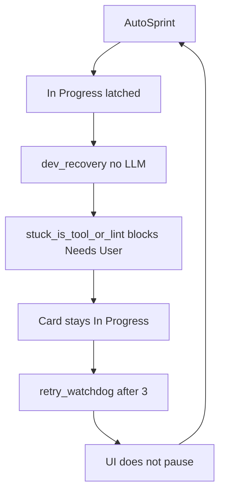

# Stop the latched-card loop so Auto Sprint can call LM Studio

The LM Studio load-before-chat path is not the current blocker. Your console shows the sprint never entering a Developer LLM turn:

- Handler is **`dev_recovery`**, not `dev`
- Exit is **`phase_cycle_cap`**, `tools=none`, `0s`, **0 Ollama calls**
- Then interrupt backoff, then the same card again
- Circuit breaker is already at **4400+** consecutive `phase_cycle_cap` exits

[`run_sprint_step`](backend/services/sprint_service.py) prefers In Progress over Backlog/CR/QA. If every In Progress card has `phaseCycleCapReached`, it always picks **`dev_recovery`**. That path ([`_recover_latched_dev_card`](backend/services/sprint_service.py)) records a stop message and escalates; it **never calls the model**.

Escalation then dies here in [`_check_stuck_and_escalate`](backend/services/sprint_service.py): PO trips are exhausted, but `stuck_is_tool_or_lint` is true (old lint/tool transcript), so the card **stays In Progress** (“not moving to Needs User”). Dev cannot retry lint because the latch forbids another `_run_developer_step`.

The zero-work watchdog *does* trip after 3 identical exits **inside one** `POST /api/sprint/run`, but [`useAutoSprint`](frontend/src/hooks/useAppState.ts) only pauses on `idle` / simulation — **not** `retry_watchdog`. The 5s interval starts a new run, the watchdog dict is empty again, backoff is reset in `run_auto_sprint`, and the storm continues. That is how you get 4421 consecutive unhealthy exits.

## Fix

1. **Park latched cards when Dev cannot run again** in [`_check_stuck_and_escalate`](backend/services/sprint_service.py): if `phaseCycleCapReached` and PO round-trips are exhausted, move to Needs User even when `stuck_is_tool_or_lint`. Lint retry is impossible while latched. Keep the lint exception for **unlatched** Dev stuck (current behavior).

2. **Do not spin forever on latched In Progress** in [`run_sprint_step`](backend/services/sprint_service.py): if every In Progress card is latched, run recovery **once** for the first latched card, then if it is still In Progress, fall through to Backlog / Refinement / CR / QA (same as empty In Progress). Skip latched cards when a non-latched In Progress card exists (already true).

3. **Treat only-latched In Progress as not sprintable** in [`has_sprint_work`](backend/services/sprint_service.py) and frontend [`hasSprintWork`](frontend/src/types/index.ts): count In Progress only if some card is **not** `phaseCycleCapReached`. After parking, auto sprint can pick real work (and call LM Studio) or go idle.

4. **Pause Auto Sprint on `retry_watchdog`** in [`useAutoSprint`](frontend/src/hooks/useAppState.ts), same as `idle`.

5. **Tests**
   - Extend [`tests/test_capped_retry_loop_regression.py`](tests/test_capped_retry_loop_regression.py): latched + exhausted PO + lint diagnostics → Needs User, no `_run_developer_step`.
   - Latched-only In Progress plus a claimable Backlog card: after one recovery that fails to move, next step claims backlog (or recovery parks, then backlog).
   - `note_zero_work_exit` already covers `phase_cycle_cap`; add a UI/hook or summary-status assertion that `retry_watchdog` pauses auto sprint (or a small unit on the status list).

This card (`Integrate ShoppingListProvider with AisleListScreen`) will stop eating every tick. To **run Dev+LLM on it again**, reset the phase-cycle latch (existing `reset_dev_cycle_latch` / in-progress override). Auto sprint will then hit the load-then-chat LM Studio path from the previous change.
