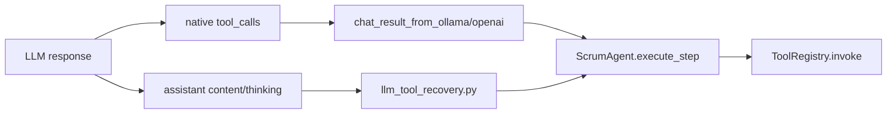
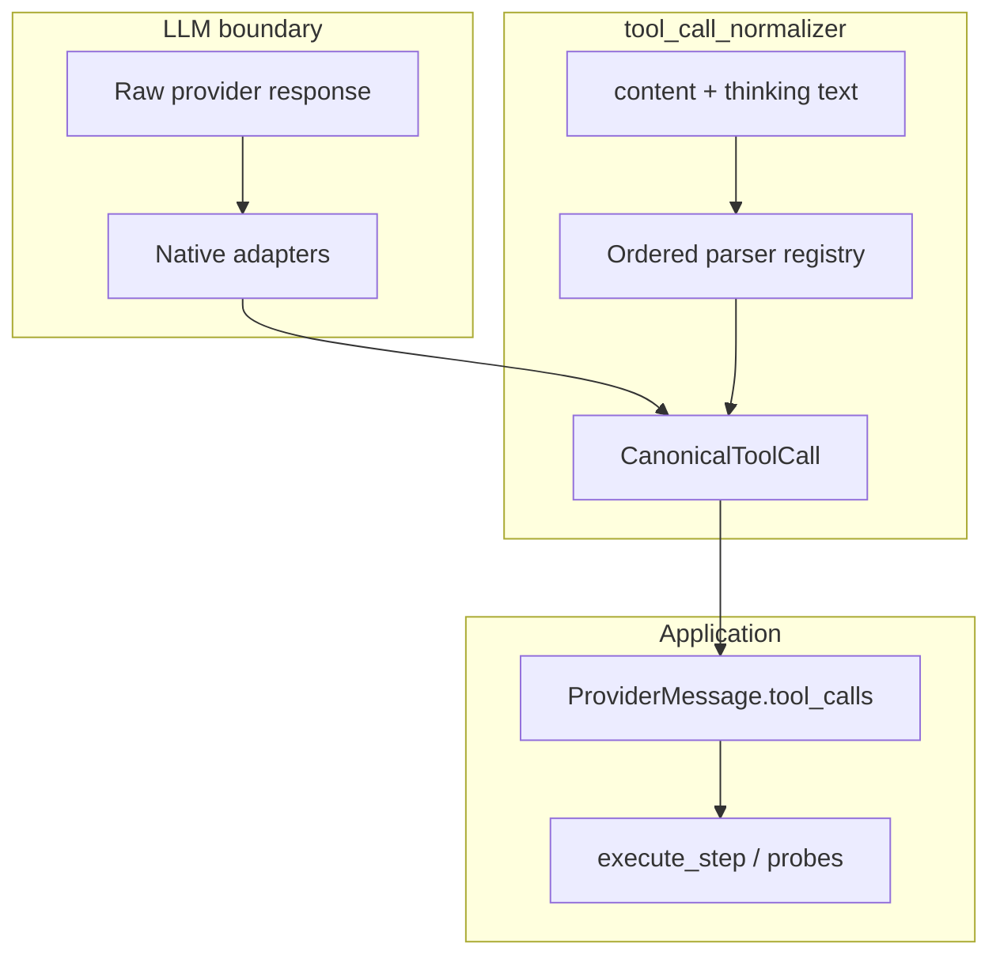

# Tool Call Translation Layer

## Current state

The app already has a **two-tier** tool model:



**What works today** ([`backend/services/llm_tool_recovery.py`](backend/services/llm_tool_recovery.py)):
- Native OpenAI/Ollama `tool_calls[]` via [`chat_result_from_ollama`](backend/services/llm_provider.py) / [`chat_result_from_openai`](backend/services/llm_provider.py)
- Content recovery for: Qwen parameter XML (`<function=name><parameter=k>v`), markdown fences, bare JSON (incl. Hermes/Mistral in many cases via JSON substring extraction)
- Entry point: [`apply_tool_call_recovery`](backend/services/llm_tool_recovery.py) called from [`ScrumAgent.execute_step`](backend/agents/scrum_agent.py) (~L3239)

**Confirmed gaps** (reproduced locally):

| Gap | Example | Impact |
|-----|---------|--------|
| `thinking` not scanned | Tool XML/JSON only in `ProviderMessage.thinking` | Reasoning models (Qwen3/R1-style) fail recovery entirely |
| Parallel Hermes calls | Multiple `<tool_call>` blocks or JSON array inside one tag | Only first call recovered |
| Alt XML variants | `<invoke name="..."><parameter name="k">` | Not parsed |
| Recovery output type | `apply_tool_call_recovery` always builds Ollama pydantic `ToolCall` | Wrong type on `ProviderMessage`; fragile outside Ollama |
| Legacy native shape | OpenAI `message.function_call` (singular) | Ignored at provider boundary |
| OpenAI streaming | [`_iter_openai_stream`](backend/services/llm_provider.py) yields content only | No tool-call delta assembly for OpenAI-compat streaming |
| Probe bypass | [`tool_llm_probe._extract_first_tool_call`](backend/services/tool_llm_probe.py) | Never runs recovery; reports false negatives for XML models |
| Partial native calls | Native `tool_calls` present (even empty/wrong) | Recovery skipped entirely |

## What Cursor / vLLM / Claude do (and what to borrow)

| System | Pattern | Takeaway for us |
|--------|---------|-----------------|
| **vLLM** | Pluggable parsers (`hermes`, `llama3_json`, `mistral`) with fast-path detection; each parser extracts from raw text → OpenAI `tool_calls` | **Parser registry + canonical output** — our extensibility model |
| **API gateways (Cursor-style)** | Translate provider-native shapes at the boundary; app code only sees one format | **Normalize in `llm_provider.py`**, not scattered in agents |
| **Claude (Anthropic API)** | Native `tool_use` blocks; no XML scraping in production | Add a **native adapter** for Anthropic-shaped responses when proxied through OpenAI-compat gateways |

We should **not** rely on JSON-substring fallback as the primary Hermes parser — it is brittle with prose, multiple calls, and mixed markup. Explicit parsers (like vLLM's `hermes_tool_parser`) are more reliable.

## Target architecture



### New module: `backend/services/tool_call_normalizer/`

Keep [`llm_tool_recovery.py`](backend/services/llm_tool_recovery.py) as a thin compatibility facade (re-export existing names) to avoid a large blast radius.

**Core types** (`canonical.py`):
```python
@dataclass
class CanonicalToolCall:
    id: str
    name: str
    arguments: dict[str, Any]
```

**Parser protocol** (`parsers/base.py`):
```python
class ToolCallTextParser(Protocol):
    name: str
    priority: int  # lower = tried earlier
    def detect(self, text: str) -> bool: ...
    def parse(self, text: str, allowed: set[str]) -> list[CanonicalToolCall]: ...
```

**Initial parsers** (each in its own file, unit-tested):

| Parser | Detect | Parse |
|--------|--------|-------|
| `HermesXmlJsonParser` | `<tool_call>` | JSON object or array per block (vLLM-style regex) |
| `QwenParameterXmlParser` | `<function=` | Existing `_QWEN_*` logic |
| `InvokeXmlParser` | `<invoke` | `name=` attr + `<parameter name=` children |
| `MistralPrefixParser` | `[TOOL_CALLS]` | JSON array after prefix |
| `MarkdownFenceParser` | `**tool**` + fence | Move from current recovery |
| `BareJsonParser` | `{` / `[` | Move from current recovery (shorthand, OpenAI shape, `parameters` alias) |

**Registry** (`registry.py`): ordered list; `parse_text_tool_calls(text, allowed) -> list[CanonicalToolCall]` runs parsers until one returns results (vLLM fast-path: `detect()` before full parse).

**Native adapters** (`native.py`):
- `normalize_openai_message(message_dict) -> list[CanonicalToolCall]` — `tool_calls[]` + legacy `function_call`
- `normalize_ollama_message(msg) -> list[CanonicalToolCall]` — dict or pydantic, string/dict args
- `normalize_anthropic_message(message_dict) -> list[CanonicalToolCall]` — `content[]` blocks with `type: tool_use` (for gateways that expose Anthropic shape through compat layers)
- Shared: coerce args via existing [`normalize_tool_arguments`](backend/services/llm_tool_recovery.py), generate stable `call_{n}` IDs

**Unified entry** (`normalize.py`):
```python
def normalize_assistant_message(
    message: ProviderMessage | dict | Any,
    allowed_tool_names: Iterable[str],
) -> tuple[ProviderMessage, list[str], str]:
    """Returns (message, recovered_names, recovery_source)."""
```
Behavior:
1. Normalize native `tool_calls` arguments in place
2. If no usable native calls, parse **`content` then `thinking`** (concatenated or tried separately)
3. Optionally merge: if native calls exist but `looks_like_raw_tool_markup(content)` and native list is empty/incomplete — extend (configurable, default on)
4. Attach **`ProviderToolCall`** instances (not Ollama pydantic) — fixes type mismatch
5. Clear `content`/`thinking` when recovery succeeds (preserve thinking only if it had no tool markup)

### Wire-up points

1. **[`apply_tool_call_recovery`](backend/services/llm_tool_recovery.py)** — delegate to `normalize_assistant_message`; keep public API unchanged
2. **[`chat_result_from_openai`](backend/services/llm_provider.py)** — use native adapter for `tool_calls` + `function_call`
3. **[`chat_result_from_ollama`](backend/services/llm_provider.py)** — use native adapter (already partially done in your working tree)
4. **[`consume_chat_stream`](backend/services/llm_provider.py)** — after fold, if `tool_calls` is empty, run text normalization on accumulated `content` + `thinking` (requires allowed tools — pass through from caller or defer to agent; **prefer deferring to agent** to avoid provider knowing tool registry)
5. **[`tool_llm_probe.run_llm_tool_probe`](backend/services/tool_llm_probe.py)** — call `apply_tool_call_recovery` before `_extract_first_tool_call`
6. **[`looks_like_raw_tool_markup`](backend/services/llm_tool_recovery.py)** — extend to detect `[TOOL_CALLS]`, `<invoke`, Hermes blocks without `<function=`

### OpenAI-compat streaming (phase 2, same PR if small)

Extend [`_iter_openai_stream`](backend/services/llm_provider.py) to accumulate `delta.tool_calls` fragments (index-keyed name/arguments/id) like the OpenAI SDK does, so native tool calls work without content recovery when the gateway streams properly.

### Extensibility hooks

- **Parser registry** is the extension point: add `ToolCallTextParser` implementations without touching agent code
- **Optional workflow setting** `toolCallParserHint` (`auto` | `hermes` | `qwen_xml` | `mistral` | `json`): when not `auto`, try that parser first (mirrors vLLM's `--tool-call-parser` flag)
- **Diagnostics**: extend recovery event payload with `recovery_source: hermes_xml | qwen_xml | mistral | markdown | json | native_openai | native_anthropic`

### Tests ([`tests/test_llm_tool_recovery.py`](tests/test_llm_tool_recovery.py) + new `tests/test_tool_call_normalizer.py`)

Fixture-driven table tests for every format:

- Hermes single + multi-block + array-in-one-tag
- Qwen parameter XML (existing test)
- Mistral `[TOOL_CALLS]`
- Invoke/parameter-name variant
- Markdown fences (existing)
- Bare JSON / shorthand / `parameters` alias
- Legacy `function_call` at provider level
- Anthropic `tool_use` content blocks
- Recovery from `thinking` only
- `ProviderMessage` output type is `ProviderToolCall`, not Ollama pydantic
- Parallel calls (2+) recovered up to `MAX_RECOVERED_TOOL_CALLS`
- Probe path recovers XML tool call

### Out of scope (document only)

- PO plan outline flow ([`sprint_service._looks_like_usable_plan_outline`](backend/services/sprint_service.py)) intentionally rejects raw tool markup — keep as-is unless you want PO planning to execute tools
- Full Anthropic/Gemini **providers** — only normalization adapters for shapes that may arrive via compat gateways
- Llama 3.2 "pythonic" `[func(a=1)]` format — add as future parser if needed

## File change summary

| File | Change |
|------|--------|
| `backend/services/tool_call_normalizer/` (new) | Canonical types, parser registry, native adapters |
| [`backend/services/llm_tool_recovery.py`](backend/services/llm_tool_recovery.py) | Thin wrapper; move logic into normalizer |
| [`backend/services/llm_provider.py`](backend/services/llm_provider.py) | Native adapters at parse boundary; streaming tool-call assembly |
| [`backend/services/tool_llm_probe.py`](backend/services/tool_llm_probe.py) | Run recovery before extraction |
| [`tests/test_tool_call_normalizer.py`](tests/test_tool_call_normalizer.py) (new) | Comprehensive format fixtures |
| [`tests/test_llm_tool_recovery.py`](tests/test_llm_tool_recovery.py) | Keep passing; add thinking/multi-call cases |

## Implementation order

1. Add `tool_call_normalizer` with canonical types + move existing parsers (no behavior change)
2. Add missing parsers (Hermes multi, invoke XML, Mistral) + thinking scan
3. Fix `apply_tool_call_recovery` to emit `ProviderToolCall`
4. Wire native adapters into `chat_result_from_*`
5. Update probe + tests
6. OpenAI streaming tool-call deltas (if time in same PR, otherwise follow-up)
