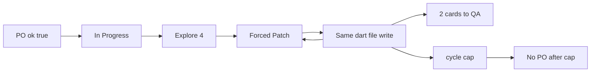

# Verdict: better, not done

Compared with the last dump (50 traces, **50/50 `ok=False`**, **0 cards left In Progress as a successful Dev completion**, hamster-wheel rewrite until cap, then wasted PO + 0.5s Dev cap).

This attached batch is **51 traces, 19:11–21:58**, same Store Management / `gemma-4-q4km:26b` job. Folder also has Sep 6 files; those were ignored.

## What improved

- **PO `ok=true` landed.** 7/7 PO steps are `ok=True` (was false even on `po_clarified` + `laneAfterTool=In Progress`). 6 `po_clarified`, 4 actually left Needs PO for In Progress.
- **Two Dev cards reached QA** (`completed_with_writes`, 12 Ollama calls, `fix_verify_done: findings remain after 2 rounds` — verify ran, not hard-stop):
  - [TASK-144F9D…](step-TASK-144F9D3038EC496EB5C8C2BCAB063A9D-20260907T201339.json) Store List View (2/2)
  - [TASK-F01CEB…](step-TASK-F01CEB2B059D498CA2AC62FF9C01D583-20260907T202943.json) after explore → two write visits → QA
- **Force-patch after write works.** 20/20 next-Dev visits after `max_iterations_after_writes` / `completed_with_writes` have `forcedPatch=true`. Zero “reset to Explore and die on explore budget” after a successful write.
- **No PO immediately after `phase_cycle_cap`.** Caps are 2 traces, ~0.8s, `ollama=0`. Previous dump spent ~2 min PO then 0.5s Dev cap on the same card.

## What is only partly better

**The hamster wheel is still there; we just skip Explore.** Card `…7885CC3B` wrote `store_list_screen.dart` on 6 straight Forced Patch visits, then a test file, then cap. Card `…BA11F9AE` did 8 write visits on the same dart file. **`identical_write_loop` exit count: 0.** Cause: [`successful_write_fingerprint`](backend/services/sprint_speed_gates.py) hashes **full `old_text|new_text`**, so “replace 107 chars” of different 107-char patches never matches. The plan asked for path + replace size (or a cheap hash); full-text hash is too unique to trip at 3.

Forced Patch still records **`exploreCount=3`** on those write visits: the graph starts in Patch, but explore tools are still allowed, so the model reads for 3 turns then writes once and hits max iters. Tax dropped vs a full Explore-budget stop, not vs a Patch-only turn.

**Stuck still sends cards to PO before the cap.** `…7885CC3B` got a 3-minute PO `update_board` at 21:09 after a no-write Forced Patch, then Explore again. Latch skip does not cover `stuckLoops → Needs PO`.

**Fix-verify still aborts round 1** on 39/44 Dev steps (`lastEvent=fix_verify_done: aborted_hard_stop`). The two QA promotions are the exception (findings remain after 2 rounds).

**Dev `ok` is still False even on QA** because historic/in-step `toolFailures` (same class of bug PO had). 43 False / 7 True / 1 incomplete.

**PO `ok=true` is slightly too eager:** `…A96B8651` 21:49 is `po_clarification_incomplete`, card stayed Needs PO, but `ok=True` because `laneAfterTool=In Progress`. [`_build_last_step_outcome`](backend/services/sprint_service.py) ORs `laneAfterTool in {In Progress, Refinement}` even when the board did not leave Needs PO.

## Scorecard vs last dump

- Logging / classification: still good
- PO `ok`: **fixed** (one false-positive incomplete)
- Force Patch after write: **fixed**
- Identical write loop: **not working** (0 trips)
- Skip PO/Dev after latch: **cap path better**; stuck-to-PO still happens
- Cards finishing: **2/10-ish cards to QA** vs **0 before** — real progress
- Fix-verify: **unchanged**, still the main reason a write does not count as done

## Recommended next pass (if you want implementation)

1. Fingerprint successful writes as **path + replace-size (or content length)**, not full old/new text, so 3 repeats of `store_list_screen.dart (replace N chars)` stop with `identical_write_loop`.
2. On Forced Patch visits, **reject explore tools** (or give them a budget of 0) so the first LLM turn must `apply_patch`/`write_file`.
3. Tighten PO `ok`: `po_clarified` **and** board left Needs PO (or `laneAfterTool` matches live lane), not `laneAfterTool` alone.
4. Optional later: let fix-verify continue after writes instead of `aborted_hard_stop` on max iters.

No code changes in this review. Confirm if you want that next pass implemented.
