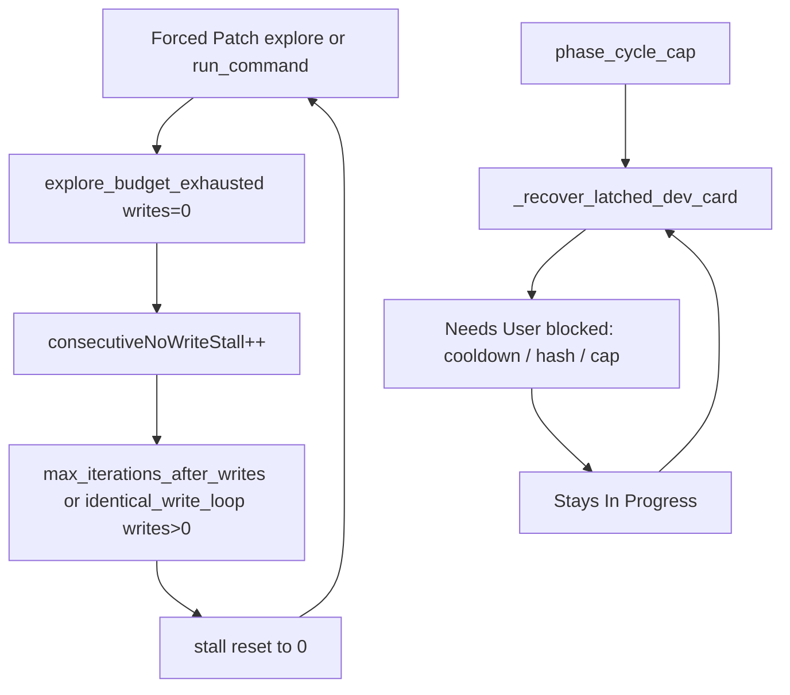

# Overnight trace review and remaining loop fixes

## What this batch shows

51 traces, **0 QA**. Developer 43 / System 6 / PO 2. `ok` almost never. Forced Patch on 44 Dev steps. Cards stayed **In Progress** except PO moving two parent cards to Done.

Dominant Dev exits: `explore_budget_exhausted` (26), `max_iterations_after_writes` (10), `phase_cycle_cap` (9), `identical_write_loop` (2).

Typical card (StoreRepository tests 1/2 and 2/2, ~13 visits each): explore-only Forced Patch → a write-cap that **stays In Progress** → stall counter resets → more explore → `phase_cycle_cap`.

Every Dev `lastEvent` is still `fix_verify_done:aborted_hard_stop`. There is **no** `skipped_lint_explore_stop` or `lint_after_write_stop`. Forced Patch still **executes** `read_file` (35s+). That means this overnight process almost certainly did **not** load the stall/reject/lint work already in tree. **Restart `python app.py` after this change** (and after the prior stall/lint commits) or the same traces will repeat.

## Remaining bugs even with current code

1. **Stall resets on any write that does not leave In Progress.** [`_record_no_write_stall`](backend/services/sprint_speed_gates.py) zeros `consecutiveNoWriteStall` whenever `writes_succeeded > 0`. A single `max_iterations_after_writes` / `identical_write_loop` visit wipes two explore stalls, then Gemma explores again. That is why cards hit visit 12 instead of parking at visit ~3.

2. **Forced Patch still allows `run_command` before a write.** [`should_block_explore_tool`](backend/services/dev_phase_graph.py) only rejects `EXPLORE_TOOLS`. Gemma’s Forced Patch pattern in this batch is `read_file` → `run_command` → maybe `apply_patch`. `run_command` is VERIFY, so `explore_only` is false and the explore-budget stop does not fire. Treat VERIFY the same as explore until `write_succeeded` on Forced Patch.

3. **Cap park often leaves the card In Progress.** [`_try_move_to_needs_user`](backend/services/sprint_service.py) still honors cooldown, duplicate hash, and the Needs User autonomous cap. Failed parks produced the 1s System `phase_cycle_cap` traces at 01:14–01:17. Last-resort [`_in_progress_exhausted_latched`](backend/services/sprint_service.py) then re-picks those cards.

4. **Write-success that stays In Progress never reaches QA.** `identical_write_loop` is not in `LINT_OK_ADVANCE_EXITS`. `max_iterations_after_writes` only advances if `lint_clean` — and this batch aborted lint. After restart, lint-after-write should set `fixVerifyLintClean`; keep that path and also park/stop identical-write loops instead of another Forced Patch explore.

PO marking parent cards Done while children spin is a separate product issue; do not block this loop fix on it.

## Implementation

### A. Forced Patch: write-only until a successful write

In [`DevPhaseGraph.should_block_explore_tool`](backend/services/dev_phase_graph.py) (or a renamed helper used from [`scrum_agent.py`](backend/agents/scrum_agent.py)): reject `EXPLORE_TOOLS` **and** `VERIFY_TOOLS` while `forced_patch and not write_succeeded`.

Treat a VERIFY-only batch with no write like explore-only for the Forced Patch nudge/stop in `observe_tools` so a `run_command`-only Forced Patch step still ends `explore_budget_exhausted` after one nudge.

Tests in [`tests/test_dev_phase_graph.py`](tests/test_dev_phase_graph.py): Forced Patch `run_command` is blocked; after `write_succeeded`, verify is allowed.

### B. Stall: count no-advance exits; do not reset on stuck writes

In [`_record_no_write_stall`](backend/services/sprint_speed_gates.py):

- Increment on `NO_WRITE_STALL_EXITS` when writes are 0 (unchanged).
- Also increment (or keep the counter) on write exits that **do not advance lane**: `max_iterations_after_writes`, `identical_write_loop`, `completed_with_writes_no_advance`, `patch_budget_exhausted`.
- Reset stall only when the lane moved or `completed_with_writes` with `progress_made`.

Pass `progress_made` into `_record_no_write_stall` from `record_consecutive_bad_exit` (already computed in [`sprint_service.py`](backend/services/sprint_service.py) as `lane_after != lane_before`).

Update [`tests/test_sprint_speed_gates.py`](tests/test_sprint_speed_gates.py): two explores + one write-cap still parks; a write that advances lane still resets.

### C. Force park on cycle cap / stall; do not re-trace exhausted cards

- For `kind="phase_cycle_cap"` (and stall recovery using the same park), bypass cooldown / same-hash / duplicate in [`should_escalate_to_needs_user`](backend/services/needs_user_guard.py), or call `move_board_stage(..., "Needs User")` directly after a failed escalate when the latch is already set.
- After `latchedRecoveryAttempted` and the card is still In Progress, **do not** select it again via `_in_progress_exhausted_latched`. Skip it so Auto Sprint can idle or work other cards. Optional: set `poAutoSkip` (already set) and a `parkFailed` flag so `has_sprint_work` stays false for that card.

Tests in [`tests/test_capped_retry_loop_regression.py`](tests/test_capped_retry_loop_regression.py): recover moves to Needs User despite cooldown; a second sprint step does not emit another System cap trace for the same card.

### D. Confirm lint-after-write + QA gate (no rewrite unless tests fail)

Keep the existing [`fix_verify_loop.py`](backend/services/fix_verify_loop.py) explore-skip / lint-after-write paths. Add one regression that a Forced Patch `run_command`-then-stop with **no** write still logs `skipped_lint_explore_stop`, not `aborted_hard_stop`.

## Verification

- `venv/bin/python -m pytest tests/test_dev_phase_graph.py tests/test_sprint_speed_gates.py tests/test_capped_retry_loop_regression.py tests/test_fix_verify_timeout.py tests/test_unhealthy_lane_advance.py -q`
- After deploy: **restart the app**. Next traces should show rejected `read_file`/`run_command` on Forced Patch, stall park by visit ~3 on mixed explore/write-cap cards, `skipped_lint_explore_stop` or `lint_after_write_stop`, and Needs User instead of 1s System ticks.