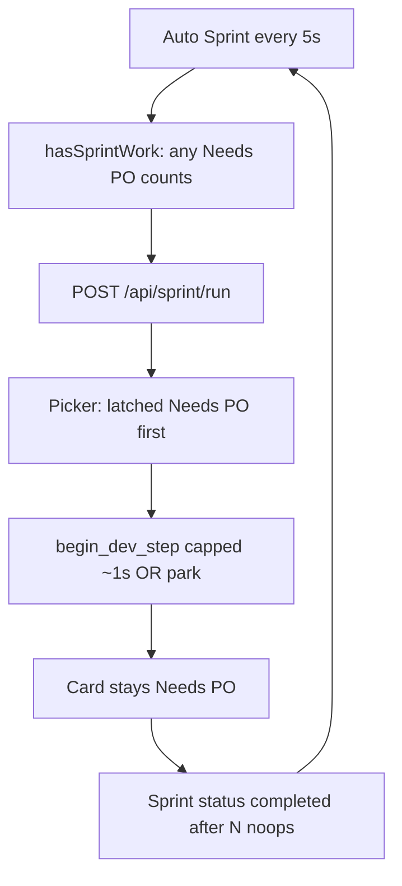

# Unblock Auto Sprint limbo (no model, empty console)

## What is happening

The attached traces for `TASK-508B5EE393BB4DB98B09DF25DB468227` (“Verify Store Name requirement and persistence”) are **not** a hung Ollama client. They are ~0.85–1.0s Developer steps with `ollamaCallCount: 0`, `lastEvent: trace_started`, `laneBefore/After: Needs PO`, and hint **“durable Developer visit limit”**. That is [`begin_dev_step`](backend/services/sprint_speed_gates.py) already latched (`phaseCycleCapReached`), not a live model run.

Uvicorn matches that: `POST /api/sprint/run` 200, then polling. You also `POST /api/logs/clear` and `/api/ollama/logs/clear`, so the Console tab is empty by design. The Model tab only moves when Ollama is called.

Two picker/work bugs keep this alive even after the Needs PO skip in [`_run_developer_step`](backend/services/sprint_service.py):

1. **Latched Needs PO is chosen before real Dev/backlog.** In [`run_sprint_step`](backend/services/sprint_service.py), after `_first_runnable_needs_po` is skipped (`needs_po_should_skip_auto` is true when `phaseCycleCapReached`), the next branch is still `latched_needs_po` → `handler=dev_recovery`. Other In Progress / Backlog cards never run.

2. **`has_sprint_work` stays true forever** for any Needs PO card with `phaseCycleCapReached` ([lines 4163–4169](backend/services/sprint_service.py)). Frontend [`hasSprintWork`](frontend/src/types/index.ts) is even coarser: **any** Needs PO or In Progress card counts. After a sprint of noop ticks, status is often `completed` (not `idle` / `retry_watchdog`), so the UI does **not** pause and kicks another `/api/sprint/run` in 5s.

Park can also fail: [`_try_move_to_needs_user`](backend/services/sprint_service.py) maps `clarification_use_po` to [`_redirect_to_needs_po`](backend/services/sprint_service.py). For `kind=phase_cycle_cap` that leaves the card in Needs PO, which the picker immediately reselects. Recovery also starts a **Developer** trace via [`_ensure_dev_step_trace`](backend/services/sprint_service.py), which is why Model/diagnostics look like “Dev is running” with no LLM.

**Restart `python app.py` after this lands.** Tonight’s traces still look like the `begin_dev_step` cap path; a process started before the skip would keep that behavior.

## Fix

### 1. Do not starve other work

In [`run_sprint_step`](backend/services/sprint_service.py):

- Remove the early `elif latched_needs_po: handler = "dev_recovery"` so latched Needs PO is **not** preferred over runnable In Progress, pending recovery, backlog, CR, or QA (same idea as [`test_recovered_latched_card_does_not_block_backlog_claim`](tests/test_capped_retry_loop_regression.py)).
- After choosing a real handler, optionally **side-park** latched Needs PO cards that are not the active task (one park, no Dev).
- If the only remaining cards are latched Needs PO / exhausted latched In Progress: run recovery **once**, then idle.

### 2. Stop treating parked latches as sprint work

[`has_sprint_work`](backend/services/sprint_service.py):

- Do **not** return True solely because Needs PO has `phaseCycleCapReached`.
- Keep True for `_in_progress_pending_recovery` (one park).
- After `latchedRecoveryAttempted` (Needs PO or In Progress), those cards are not work unless something else is claimable.

Align [`hasSprintWork`](frontend/src/types/index.ts): skip Needs PO with `phaseCycleCapReached` / `poAutoSkip`; do not treat exhausted latched In Progress as work when other lanes are empty.

### 3. Park must stick (no bounce to Needs PO)

In [`_try_move_to_needs_user`](backend/services/sprint_service.py) (or [`should_escalate_to_needs_user`](backend/services/needs_user_guard.py)): if `kind == "phase_cycle_cap"`, **never** `clarification_use_po` / `_redirect_to_needs_po`. Cooldown/duplicate after a failed park: still set `latchedRecoveryAttempted` and `poAutoSkip` so the picker moves on.

[`_recover_latched_dev_card`](backend/services/sprint_service.py): use a **System** trace (`_ensure_step_trace(..., "System", ...)`), log a warning even if park fails, and do not call Developer/`begin_dev_step`. Keep the existing skip in [`_run_developer_step`](backend/services/sprint_service.py).

### 4. Auto Sprint should idle, not “complete” a noop run

If every step in [`run_auto_sprint`](backend/services/sprint_service.py) is 0 Ollama (cap/park/skip) and nothing else is runnable, set summary status `idle` (or keep `retry_watchdog` after the existing streak). Frontend already pauses on `idle` / `retry_watchdog` in [`useAppState.ts`](frontend/src/hooks/useAppState.ts).

Ensure `_record_last_step_outcome` on park/skip sets `exitReason` + `taskId` so [`note_zero_work_exit`](backend/services/sprint_speed_gates.py) can fire inside a single sprint.

## Tests

Update / add in [`tests/test_capped_retry_loop_regression.py`](tests/test_capped_retry_loop_regression.py) and [`frontend/src/types/hasSprintWork.test.ts`](frontend/src/types/hasSprintWork.test.ts):

- Latched Needs PO + a claimable Backlog / runnable In Progress → Dev or backlog handler, **not** recovery-only; other card actually selected.
- Latched Needs PO only → one park (Needs User), then `has_sprint_work()` is False.
- `phase_cycle_cap` park is not redirected to Needs PO even if the message looks “clarification-shaped”.
- Frontend `hasSprintWork` is false when the only cards are latched Needs PO.

Run: `venv/bin/python -m pytest tests/test_capped_retry_loop_regression.py tests/test_needs_user_brief.py frontend/src/types/hasSprintWork.test.ts` (plus any new cases).

## After you confirm

Restart `python app.py`, leave Auto Sprint on. Expect a Console line like `skipping Developer — card is in Needs PO` or `Sprint handler: dev — '<other card>'`, then Ollama traffic. The Store Name card should sit in Needs User until you split it or reset the latch — it should not consume every sprint tick.