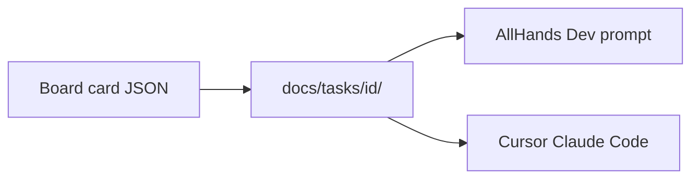

# Unify card docs for other agents

They overlap in purpose (per-card project memory) but not in audience.

| Location | What it is | Who sees it |
|---|---|---|
| [`docs/tasks/{id}-spec.md`](backend/services/task_spec_markdown.py) + `-qa.md` | Durable SDD: title, AC, story, scope, test plan; importable to rebuild the board | Humans, git, other coding agents |
| [`.allhands/cards/{id}/`](backend/services/card_ledger.py) `plan.md` `notes.md` `tasks.json` | Bounded Dev scratchpad injected before the transcript | AllHands only; often invisible (dot dir, frequently gitignored) |

Other tools (Cursor, Claude Code, Codex, Aider) already look in `docs/` and ignore `.allhands/`. Keeping two trees means they implement from a stale spec while AllHands “thinks” in a hidden ledger.

**Chosen layout:** one folder per card, all markdown, under the workspace:

```
docs/tasks/{id}/
  README.md      # same content as today’s spec (overview, story, AC, scope, test plan)
  notes.md       # ledger notes (ideation, cutoff salvage)
  plan.md        # next steps (replace tasks.json as the portable form)
  qa.md          # today’s -qa.md
```

Card JSON on the board remains the live source AllHands edits; these files stay generated/synced views plus working notes. Import continues to parse `README.md` (and still accepts legacy `docs/tasks/{id}-spec.md`).

Do **not** invent a second format like a giant `TASKS.md` (does not scale) or AGENTS.md-only (that is repo-wide procedure, not per-card AC).



## Implementation

- Change prefixes in [task_spec_markdown.py](backend/services/task_spec_markdown.py) and [task_qa_markdown.py](backend/services/task_qa_markdown.py) to `docs/tasks/{id}/README.md` and `qa.md`.
- Point [card_ledger.py](backend/services/card_ledger.py) `LEDGER_REL` at `docs/tasks` (same folder). Keep size caps. Write next-work as `plan.md` markdown list; drop requiring `tasks.json` (still read old `.allhands/cards/{id}/tasks.json` once if present).
- [task_spec_import.py](backend/services/task_spec_import.py): glob `docs/tasks/*/README.md` and leftover `*-spec.md`.
- On first read/write, copy from `.allhands/cards/{id}/` and flat `docs/tasks/{id}-spec.md` into the new folder if the new files are missing.
- Update UI copy in [TaskDetailModal.tsx](frontend/src/components/TaskDetailModal.tsx), [BoardRecoveryPanel.tsx](frontend/src/components/BoardRecoveryPanel.tsx), [WorkflowPanel.tsx](frontend/src/components/WorkflowPanel.tsx), [README.md](README.md).
- Tests: path helpers, import of both layouts, ledger read fallback from `.allhands/cards`.

`.allhands/` in this repo’s gitignore stays for AllHands app data; **workspace** task docs live in `docs/tasks` so they can be committed with the product.