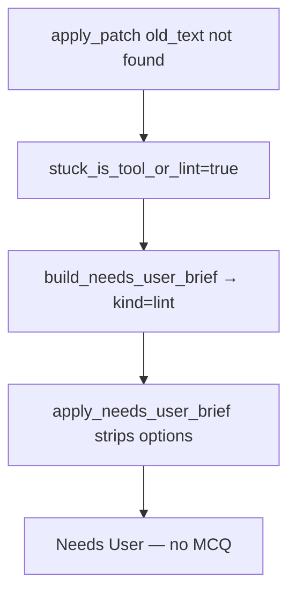

# User-Free Needs User + Autonomous Patch Recovery

## What you are seeing

Your card’s copy (“blocked on lint or tool failures… apply_patch… old_text not found”) is the **`lint` brief** from [`build_needs_user_brief`](backend/services/needs_user_guard.py). That brief is **intentionally option-less**:

```687:691:backend/services/needs_user_guard.py
    options = brief.get("options")
    if isinstance(options, list) and options and str(brief.get("kind") or "") != "lint":
        task["needsUserOptions"] = options
    else:
        task.pop("needsUserOptions", None)
```

So you land in Needs User with a wall of text and **no A/B/C/D** — exactly the wrong lane for an `apply_patch` mismatch the Developer should fix alone.

Cards get there through gaps in the guard:

| Path | Guard today | Problem |
|------|-------------|---------|
| `_try_move_to_needs_user` | Blocks `stuck_is_tool_or_lint` unless `phase_cycle_cap` | PO-exhaust bypass (`allowed=True` after `clarification_use_po`) still parks tool-failure cards |
| `move_board_stage(..., "Needs User")` | **No guard** — only fills brief via `ensure_needs_user_brief` | Manual drag / UI move creates lint/explore briefs with no options |
| `normalize_task` on Needs User cards | Calls `ensure_needs_user_brief` | Backfills lint/explore copy on load, never reconciles out |
| Dev `update_board` → Needs User | `should_escalate_to_needs_user` | Correct for lint, but other paths bypass |



**Target policy (your ask):** Needs User only when there are **real choices** for you. Everything else stays **In Progress** and Developer retries (Forced Patch, read_file → write_file fallback).

---

## Fix 1 — Needs User admission gate (options required)

**File:** [`backend/services/needs_user_guard.py`](backend/services/needs_user_guard.py)

Add helpers:

```python
_AUTONOMOUS_KINDS = frozenset({"lint", "explore", "patch"})

def brief_has_actionable_options(brief: dict) -> bool:
    opts = brief.get("options") or []
    return isinstance(opts, list) and len(opts) >= 2

def should_park_in_needs_user(task, brief) -> tuple[bool, str]:
    kind = str(brief.get("kind") or "")
    if kind in _AUTONOMOUS_KINDS:
        return False, "autonomous_tool_blocker"
    if stuck_is_tool_or_lint(task) and kind not in ("secret", "phase_cycle_cap", "product_choice"):
        return False, "lint_use_file_blocker"
    if not brief_has_actionable_options(brief):
        return False, "no_mcq_options"
    return True, ""
```

Wire into:

- [`_try_move_to_needs_user`](backend/services/sprint_service.py) (~1211): build brief first; if `should_park_in_needs_user` is false → **do not move**; call new `reroute_tool_blocker_to_dev(task_id, task, reason)` instead (sets `forcePatchNextDevStep`, clears NU fields, keeps In Progress).
- Remove/limit PO-exhaust bypass (~1220–1225): when `block_reason == "clarification_use_po"` **and** `stuck_is_tool_or_lint(task)`, reroute to Dev instead of forcing `allowed=True`.
- [`move_board_stage`](backend/services/board_service.py) (~176): before moving to Needs User, build brief + run admission gate; return error string if blocked (same as registry guard).
- [`_guarded_update_board`](backend/agents/registry.py): after `should_escalate_to_needs_user`, also require `should_park_in_needs_user`.

**Allowed Needs User kinds (with MCQ):**

- `secret` — credentials
- `phase_cycle_cap` — split vs reset latch (already has options)
- `product_choice` — explicit irreversible product decision
- `po_limit` — empty/vague spec **only when** options are generated (keep existing A/B/C/Other)

**Never park:**

- `lint`, `explore`, `patch` brief kinds
- Any card whose blocker is `apply_patch` / lint diagnostics / failed tools

Delete the lint-specific option strip in `apply_needs_user_brief` (moot once lint never parks).

---

## Fix 2 — Reconcile misrouted Needs User cards

**File:** [`backend/services/needs_user_guard.py`](backend/services/needs_user_guard.py) + [`backend/services/sprint_service.py`](backend/services/sprint_service.py)

Add `reconcile_autonomous_needs_user_cards()`:

- Scan `Needs User` lane each sprint tick (start of [`run_sprint_step`](backend/services/sprint_service.py), alongside file-blocker reconcile).
- If `needsUserKind in (lint, explore, patch)` OR (`not needsUserOptions` and `stuck_is_tool_or_lint`) OR brief text matches patch/lint patterns (`old_text not found`, `apply_patch`, `blocked on lint`):
  - `move_board_stage(id, "In Progress")`
  - Clear `userQuestion`, `needsUserReason`, `needsUserAction`, `needsUserOptions`
  - Set `forcePatchNextDevStep=True`; for lint wall cards call `_keep_lint_card_for_developer`
  - Log: “Reconciled misrouted Needs User → In Progress (autonomous fix)”

Also call from [`normalize_task`](backend/agents/task_context.py) when loading Needs User cards **only if** admission would fail (avoid fighting intentional secret/cap cards).

---

## Fix 3 — Harden apply_patch so Dev succeeds without you

Repeated `old_text not in last read_file` is a **tool workflow** issue, not a user decision.

**Files:** [`backend/workspace/files.py`](backend/workspace/files.py), [`backend/services/tool_execution_service.py`](backend/services/tool_execution_service.py) (or scrum_agent batch hook), [`backend/services/sprint_service.py`](backend/services/sprint_service.py) (`_force_patch_dev_instruction`)

1. **Per-step apply_patch cap per path** — after 2 failures on the same path in one Dev step, reject further `apply_patch` on that path with: “use read_file + write_file with full corrected file.” (Message already exists at lines 769–773; enforce in tool gate, not just text.)
2. **Invalidate stale read cache on successful write** — when `write_file` succeeds on path P, remove P from `STEP_FILE_READS` so the next patch cannot use stale pre-read context.
3. **Forced Patch instruction** — inject last failed tool summary (`old_text not found on lib/main.dart`) + explicit “read_file then write_file full file” when `identicalPatchFailCount >= 2` or last failure class is `patch_mismatch`.
4. **Keep** existing [`patch_recovery.py`](backend/services/patch_recovery.py) nudges in scrum_agent; ensure recovery path prefers `write_file` after reminder inject.

---

## Fix 4 — Tests

| Test | File | Asserts |
|------|------|---------|
| Lint/tool card blocked from Needs User even when PO exhausted | `tests/test_needs_user_brief.py` | `_try_move_to_needs_user` returns False; stays In Progress |
| Manual `move_board_stage` to Needs User rejected for explore/read_only | same | error message; no lane change |
| Reconcile moves lint-kind NU card back to In Progress + forcePatch | new in `tests/test_needs_user_brief.py` | options cleared |
| phase_cycle_cap still parks with MCQ options | existing `test_phase_cycle_cap_brief_stores_options` | unchanged |
| apply_patch blocked after 2 fails on same path | `tests/test_apply_patch_harden.py` or extend | third call rejected |
| Secret / product_choice still get options | `tests/test_needs_user_brief.py` | options present |

---

## Expected behavior

- **apply_patch / lint / tool failures:** card stays In Progress; auto sprint retries Developer; you are **not** notified unless you opted into phone alerts for real decisions.
- **Needs User:** only cards with **A/B/C/D (+ Other)** — split vs reset, OAuth provider, credentials, genuine product forks.
- **Misrouted cards already in Needs User:** next sprint tick snaps them back to In Progress automatically.
- **Your stuck card now:** click “Send to Developer” or wait for reconcile after backend restart; no need to answer “which lint error to fix first.”

## Files to change

- [`backend/services/needs_user_guard.py`](backend/services/needs_user_guard.py) — admission gate, reconcile, reroute helper
- [`backend/services/sprint_service.py`](backend/services/sprint_service.py) — `_try_move_to_needs_user`, reconcile hook, forced-patch hint
- [`backend/services/board_service.py`](backend/services/board_service.py) — guard manual Needs User moves
- [`backend/agents/registry.py`](backend/agents/registry.py) — admission gate on update_board
- [`backend/agents/task_context.py`](backend/agents/task_context.py) — optional normalize reconcile
- [`backend/workspace/files.py`](backend/workspace/files.py) — patch fail cap + read cache invalidation
- Tests: [`tests/test_needs_user_brief.py`](tests/test_needs_user_brief.py), patch tests
