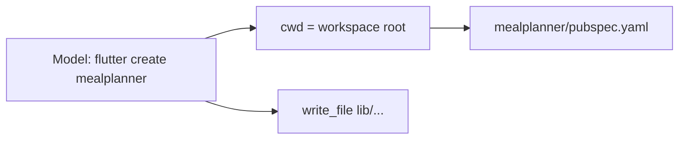

# Workspace path safeguards

The tree in your screenshot is the usual split-brain: AllHands always runs commands with `cwd` = workspace (`local_meal_planner_4`), but the model ran something like `flutter create mealplanner`. That CLI **creates a child project**, so you get a full Flutter app under `mealplanner/` (`pubspec.yaml`, `android/`, `ios/`, …) while the agent also writes app code at workspace `lib/`. File tools then keep both trees because `resolve_workspace_path` only strips the **workspace folder name**, not a nested project slug.

Today we already:

- Run every `run_command` in [backend/services/terminal_service.py](backend/services/terminal_service.py) with `cwd=state.WORKSPACE_DIR` and block `cd`.
- Map in-workspace **absolute** paths to relatives and strip a leading workspace basename in [backend/workspace/files.py](backend/workspace/files.py) (`local_meal_planner_4/lib/x.dart` → `lib/x.dart`).
- Auto-scaffold Vite **into `.`**, but **not Flutter** — [backend/services/workspace_structure_audit.py](backend/services/workspace_structure_audit.py) has no Flutter detector, so [backend/services/workspace_scaffold.py](backend/services/workspace_scaffold.py) never runs `flutter create .`.

## 1. Rewrite project-create CLIs to the workspace (`.` )

Add a small rewriter (e.g. `rewrite_scaffold_command` in [backend/services/command_policy.py](backend/services/command_policy.py) or a new `backend/services/scaffold_commands.py`) called from `run_command` **before** `subprocess.run`.

Rewrite when the last create-target is a new directory name (not `.` / `./`):

- `flutter create [flags] mealplanner` → `flutter create [flags] . --project-name mealplanner` (skip if target is already `.`)
- `dotnet new … -n Foo` (no `-o`) → add `-o .` (fixes the same bug in [scaffold_dotnet](backend/services/workspace_scaffold.py), which currently uses `-n {name}` and would nest)
- `npm create vite@latest foo -- --template …` → `npm create vite@latest . -- --template …` (already used for auto-scaffold)

Return the rewritten command plus a one-line tool note so the model sees that the workspace **is** the project.

Do **not** rewrite real monorepo creates (`packages/…`, `apps/…`) or `flutter create` when `pubspec.yaml` already exists at root (then the command should be blocked or no-op’d).

## 2. Canonicalize tool paths: more than the folder basename

Extend `resolve_workspace_path` in [backend/workspace/files.py](backend/workspace/files.py):

- Keep current behavior: empty reject, abs-inside-workspace → relative, `..` reject, workspace basename strip.
- Also strip a **single** leading segment when it matches a project slug **and** would nest the stack:
  - workspace basename (already)
  - `PROJECT_NAME` slug (`mealplanner`, sanitized)
  - `name:` from root `pubspec.yaml` if present
- If the first segment is a **detected nested stack root** (child has `pubspec.yaml` / `package.json` / `*.csproj`, and that child is not `lib`/`src`/`android`/`ios`/`packages`/`apps`) **and** the workspace root already has the same stack marker **or** a `lib/` / `src/` tree, strip that prefix and tell the tool result: `using workspace-relative path 'lib/foo.dart' (dropped nested prefix 'mealplanner/')`.

Leave legitimate paths like `packages/foo/lib/bar.dart` alone.

Apply this for `read_file` / `write_file` / `apply_patch` / `list_dir` / `delete_file` via the existing resolver so absolute paths such as `/…/local_meal_planner_4/mealplanner/lib/x.dart` collapse to `lib/x.dart` when the nest is a duplicate, not a monorepo package.

## 3. Flutter structure audit + auto-scaffold at `.`

Add `detect_flutter` (`pubspec.yaml` + `sdk: flutter` or `lib/*.dart`) to `_DETECTORS` in [backend/services/workspace_structure_audit.py](backend/services/workspace_structure_audit.py). Critical missing: `pubspec.yaml`, `lib/main.dart` as appropriate.

Add `scaffold_flutter()` in [backend/services/workspace_scaffold.py](backend/services/workspace_scaffold.py):

`flutter create . --project-name <slug> --overwrite`

Wire it in `maybe_auto_scaffold` when the stack is Flutter and the workspace is empty-for-stack (no root `pubspec.yaml`).

Warn in the structure audit when **root has no `pubspec.yaml` but exactly one child directory does** — so Dev prompts see the nest instead of treating the tree as “unknown/complete”.

## 4. Prompt / tool-text (short, not a novel)

One sentence in Developer system + local_slm step instructions ([backend/services/prompt_defaults.py](backend/services/prompt_defaults.py), [backend/services/prompt_profile.py](backend/services/prompt_profile.py)) and `write_file` / `run_command` tool descriptions ([backend/agents/registry.py](backend/agents/registry.py)):

Workspace directory **is** the app root. Use paths like `lib/main.dart`. Never `flutter create <name>` / `dotnet new -n` into a subdirectory; use `.`. Never prefix paths with the project folder name.

## 5. Tests

- Path: abs workspace path, `mealplanner/lib/x.dart` stripped when nested duplicate, `packages/foo/lib/x.dart` kept, basename strip still works ([tests/test_smoke.py](tests/test_smoke.py) `test_resolve_workspace_path_variants`, [tests/test_workspace_path_plausibility.py](tests/test_workspace_path_plausibility.py)).
- Commands: `flutter create mealplanner` rewrites to `. --project-name mealplanner`; `flutter create .` unchanged; `cd` still blocked.
- Scaffold: Flutter empty workspace → `flutter create .` command (mock runner); `dotnet new` uses `-o .`.
- Audit: nested-only `pubspec.yaml` produces a warning.

## Out of scope (existing tree)

This change **does not** auto-merge your current `mealplanner/` into `local_meal_planner_4/` (root `lib/` and nested `lib/` would collide). After the safeguard lands, flatten that workspace once by hand (or a later one-shot “promote nested project” action if you want it).
